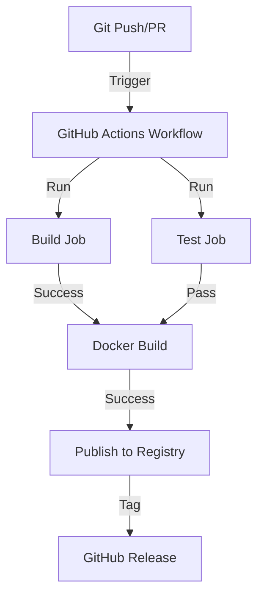

<!-- Parent: ../AGENTS.md -->
<!-- Generated: 2026-03-09 | Updated: 2026-03-09 -->

# .github

## Purpose
GitHub 工作流、Issue 模板和 CI/CD 配置。

## Key Files

| File | Description |
|------|-------------|
| `workflows/release.yml` | Docker 构建、测试和发布工作流 |
| `ISSUE_TEMPLATE/bug_report.md` | Bug 模板 |
| `ISSUE_TEMPLATE/feature_request.md` | Feature request 模板 |
| `FUNDING.yml` | 赞助配置 |

## Subdirectories

| Directory | Purpose |
|-----------|---------|
| `workflows/` | GitHub Actions 工作流 (见 `workflows/AGENTS.md`) |
| `ISSUE_TEMPLATE/` | 标准化的 Issue 模板 (见 `ISSUE_TEMPLATE/AGENTS.md`) |

<!-- MANUAL: -->

## GitHub Actions Flow

