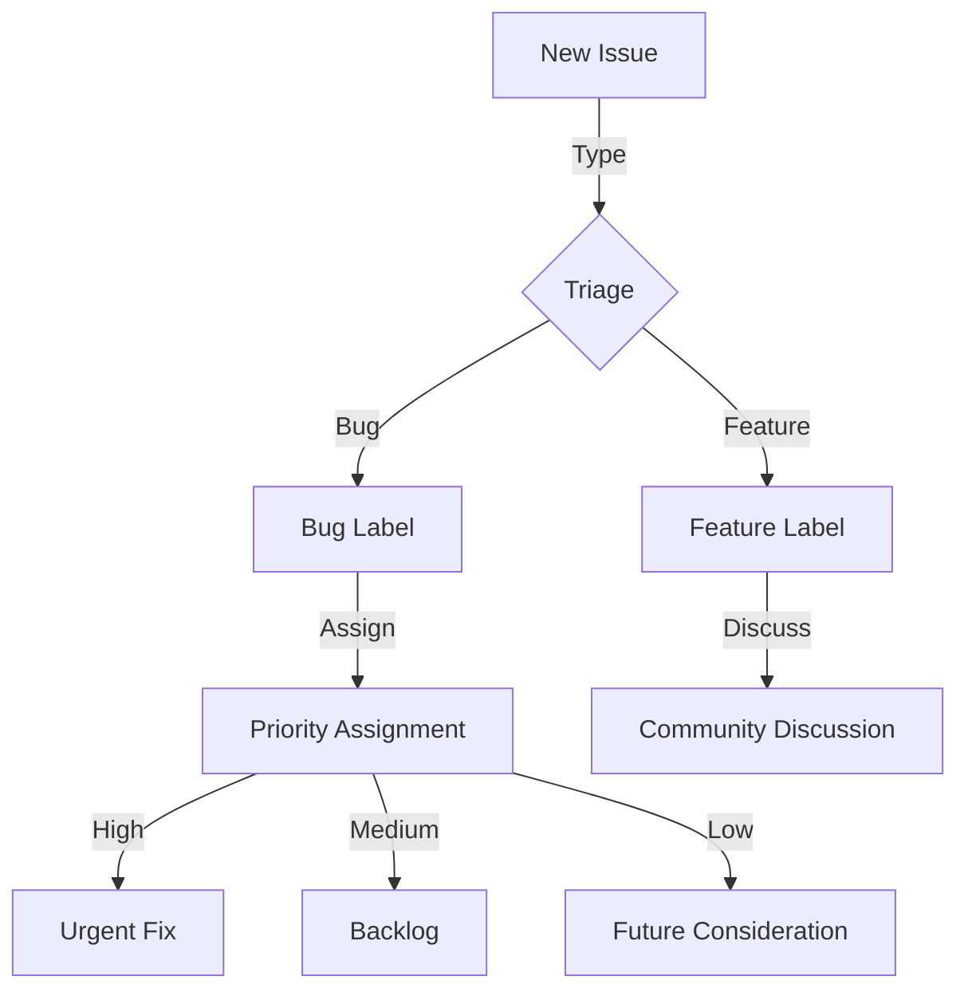

<!-- Parent: ../AGENTS.md -->
<!-- Generated: 2026-03-09 | Updated: 2026-03-09 -->

# ISSUE_TEMPLATE

## Purpose
GitHub Issue 模板，规范 bug 和功能请求的提报格式。

## Key Files

| File | Description |
|------|-------------|
| `bug_report.md` | Bug 报告模板 |
| `feature_request.md` | 功能请求模板 |

## Issue Triage Flow

