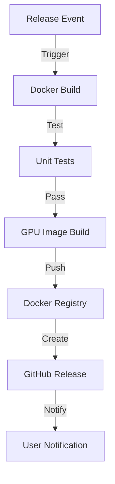

<!-- Parent: ../AGENTS.md -->
<!-- Generated: 2026-03-09 | Updated: 2026-03-09 -->

# workflows

## Purpose
GitHub Actions 工作流定义。

## Key Files

| File | Description |
|------|-------------|
| `release.yml` | 构建 Docker 镜像、运行测试并处理发布流程 |

## For AI Agents

### Working In This Directory
- 该仓库当前只有一个主工作流，覆盖 PR 构建、GPU 镜像构建和测试
- 工作流里的 Dockerfile 路径必须与 `docker/` 目录保持一致

## Release Workflow

