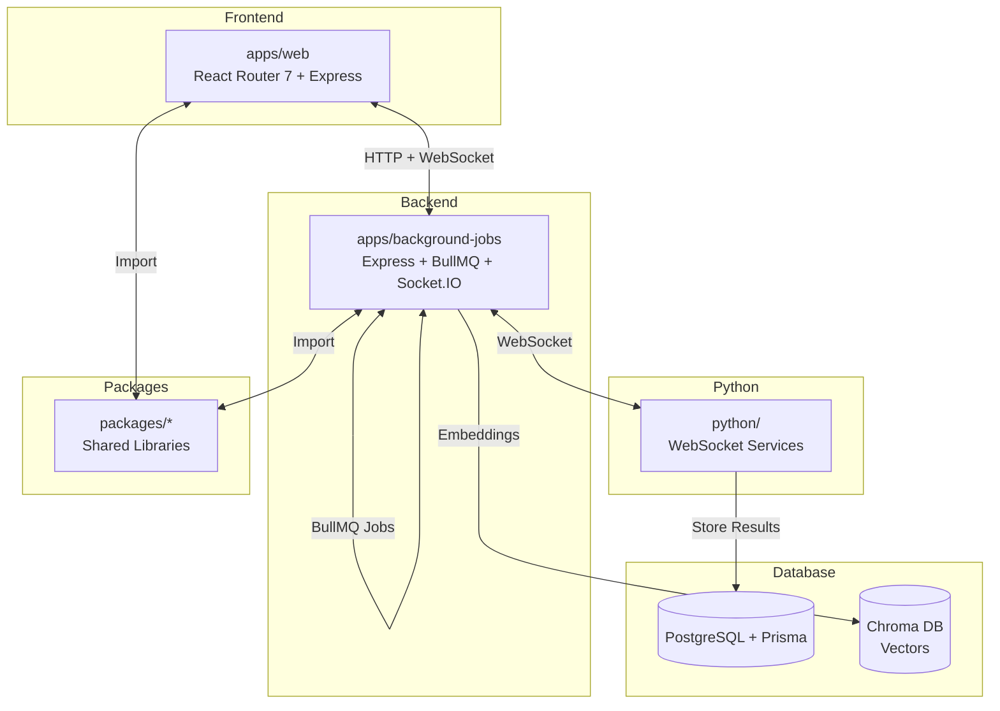

<!-- Generated: 2026-03-09 | Updated: 2026-03-09 -->

# edit-mind

## Purpose
本仓库是一个本地优先的视频索引、分析与搜索平台。前端提供视频浏览、搜索、集合和聊天体验，后台作业服务负责索引流水线，Python 服务负责分析和转录。

## Key Files

| File | Description |
|------|-------------|
| `README.md` | 产品说明和本地运行方式 |
| `package.json` | 项目依赖和脚本 |
| `pnpm-workspace.yaml` | pnpm 工作区配置 |
| `turbo.json` | Turborepo 任务配置 |
| `tsconfig.json` | TypeScript 根配置 |
| `eslint.config.mjs` | ESLint 配置 |
| `.prettierrc` | Prettier 格式化配置 |
| `docker-compose.yml` | 根级容器编排配置 |
| `docker-compose.cuda.yml` | 根级 CUDA 容器编排配置 |
| `prisma.config.ts` | Prisma ORM 配置 |
| `.env.example` | 环境变量模板 |
| `.env.system.example` | 系统环境变量模板 |

## Subdirectories

| Directory | Purpose |
|-----------|---------|
| `apps/` | 应用程序入口 (见 `apps/AGENTS.md`) |
| `packages/` | 共享包和库 (见 `packages/AGENTS.md`) |
| `python/` | Python 服务和分析模块 (见 `python/AGENTS.md`) |
| `docker/` | Dockerfiles 和开发期 Compose 配置 (见 `docker/AGENTS.md`) |
| `.github/` | GitHub 工作流和模板 (见 `.github/AGENTS.md`) |
| `.vscode/` | VSCode 编辑器设置 |

## For AI Agents

### Working In This Directory
- 使用 pnpm 作为包管理器 (`pnpm install`, `pnpm add`, `pnpm remove`)
- 根目录主要提供 workspace 级构建配置；开发命令通常按包过滤运行，例如 `pnpm --filter web dev`
- JavaScript workspace 只包含 `apps/*` 和 `packages/*`；`python/` 是独立服务树
- TypeScript 严格模式在各工作区包内启用
- 遵循 ESLint 和 Prettier 规则

### Testing Requirements
- 运行测试前确保依赖已安装
- 使用项目配置的测试框架
- 确保修改的代码有适当的测试覆盖

### Common Patterns
- Monorepo 架构，共享包通过 `packages/` 导入
- `apps/web/` 是 React Router 7 + Express 适配器应用
- `apps/background-jobs/` 是 Express + BullMQ + Socket.IO 服务
- `python/` 通过 `websockets` 协议提供分析和转录能力
- Prisma ORM 用于数据库操作
- Python 服务用于 AI/ML 功能

## Dependencies

### Internal
- `apps/web/` - React Router 7 前端/服务端应用
- `apps/background-jobs/` - Node.js 后台任务与内部 API 服务
- `packages/*` - 共享库和工具

### External
- React 19.x - UI 框架
- React Router 7 - Web 路由与构建
- TypeScript 5.x - 类型安全
- Prisma - 数据库 ORM
- Turborepo - 构建工具
- pnpm - 包管理器

## Architecture Flow

<!-- MANUAL: 自定义项目说明可以添加在下方 -->
