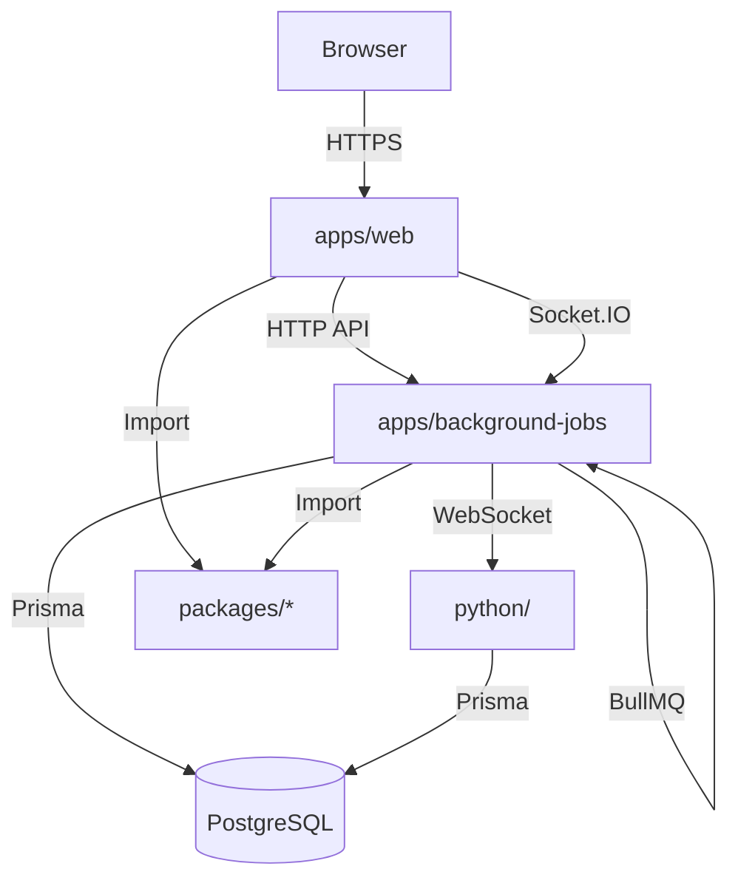

<!-- Parent: ../AGENTS.md -->
<!-- Generated: 2026-03-09 | Updated: 2026-03-09 -->

# apps

## Purpose
包含两个主要运行时应用：面向用户的 Web 应用，以及负责索引、导出、导入和 AI 管道的后台作业服务。两个应用共享 `packages/` 中的库。

## Key Files

| File | Description |
|------|-------------|
| `web/package.json` | Web 应用依赖和脚本 |
| `web/app/routes.ts` | Web 路由入口 |
| `background-jobs/package.json` | 后台作业服务依赖 |
| `background-jobs/src/index.ts` | 后台服务入口 |

## Subdirectories

| Directory | Purpose |
|-----------|---------|
| `web/` | React Router 7 前端应用 (见 `web/AGENTS.md`) |
| `background-jobs/` | Node.js 后台作业服务 (见 `background-jobs/AGENTS.md`) |

## For AI Agents

### Working In This Directory
- 每个应用都有独立的依赖和配置
- 共享代码应放在 `packages/` 中而非 `apps/`

### Common Patterns
- Web 端使用 React Router 7 文件路由和服务端处理
- 后台服务同时暴露内部 HTTP 路由、BullMQ 作业和文件夹监听
- 实时状态主要通过 Socket.IO 和 Python WebSocket 集成传递

## Dependencies

### Internal
- `packages/ui/` - 共享 UI 组件
- `packages/shared/` - 共享工具和类型

### Common Patterns
- Web 端使用 React Router 7 文件路由和服务端处理
- 后台服务同时暴露内部 HTTP 路由、BullMQ 作业和文件夹监听
- 实时状态主要通过 Socket.IO 和 Python WebSocket 集成传递

## Application Communication Flow

<!-- MANUAL: -->
