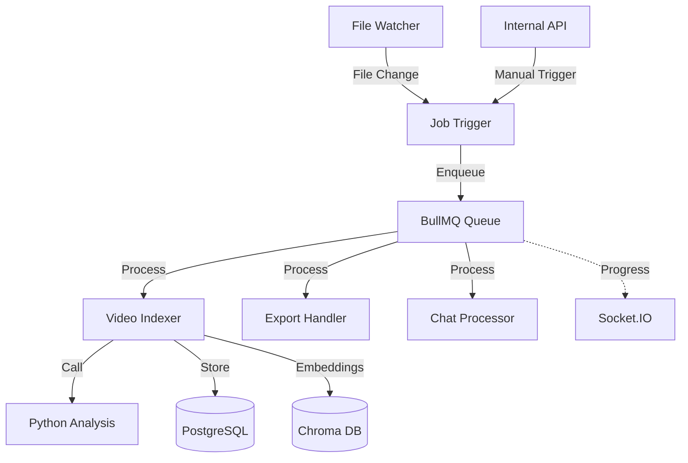
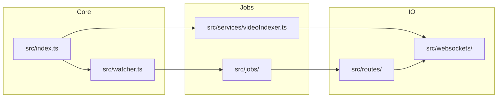

<!-- Parent: ../AGENTS.md -->
<!-- Generated: 2026-03-09 | Updated: 2026-03-09 -->

# background-jobs

## Purpose
Node.js 后台服务，负责文件夹监听、索引流水线、导出、聊天处理、Immich 导入以及内部管理 API。

## Key Files

| File | Description |
|------|-------------|
| `src/index.ts` | 服务入口 |
| `src/jobs/` | 作业定义 |
| `src/routes/` | 内部 HTTP 路由 |
| `src/services/videoIndexer.ts` | 视频索引编排逻辑 |
| `src/watcher.ts` | 文件夹监听入口 |

## Subdirectories

| Directory | Purpose |
|-----------|---------|
| `src/jobs/` | 作业队列处理 |
| `src/middleware/` | 中间件 |
| `src/routes/` | API 路由 |
| `src/schemas/` | 数据验证 |
| `src/services/` | 业务服务 |
| `src/types/` | 类型定义 |
| `src/utils/` | 工具函数 |
| `src/websockets/` | WebSocket 处理 |
| `tests/` | 测试套件 |

## For AI Agents

### Working In This Directory
- 作业处理使用 BullMQ 队列系统
- 服务同时提供内部 Express API 和 Socket.IO 状态更新
- 文件夹扫描与监听逻辑会直接触发索引任务
- 与 Python 服务协作处理 AI 任务

## Job Processing Flow

## Service Architecture

<!-- MANUAL: -->
