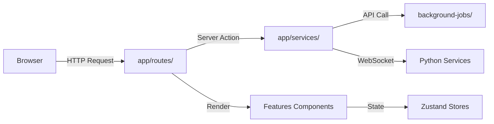
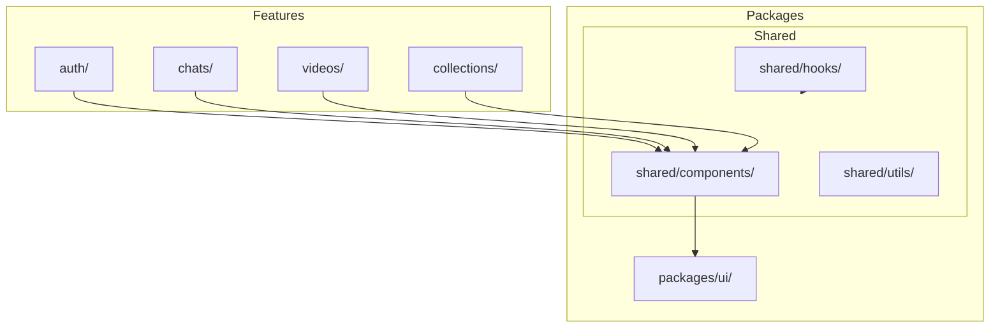

<!-- Parent: ../AGENTS.md -->
<!-- Generated: 2026-03-09 | Updated: 2026-03-09 -->

# web

## Purpose
React Router 7 Web 应用，提供视频浏览、搜索、聊天、集合、项目和设置等界面，同时包含服务端路由与会话逻辑。

## Key Files

| File | Description |
|------|-------------|
| `app/root.tsx` | 根组件 |
| `app/routes.ts` | 路由配置 |
| `server/app.ts` | Express 请求处理入口 |
| `package.json` | 应用依赖 |

## Subdirectories

| Directory | Purpose |
|-----------|---------|
| `app/` | 应用源码树 (见 `app/AGENTS.md`) |
| `app/layouts/` | 布局组件 |
| `app/routes/` | 路由定义 |
| `app/services/` | 服务层 |
| `app/types/` | 类型定义 |
| `public/` | 静态资源 |
| `server/` | 服务器代码 |
| `tests/` | 测试套件 |

## For AI Agents

### Working In This Directory
- 使用 React 19 和 React Router 7
- `app/routes/` 负责页面与 API 路由，`app/services/` 负责服务端集成
- 功能模块组织在 `app/features/` 下，但不同功能的内部结构并不完全相同

## Request Flow

## Component Architecture

<!-- MANUAL: -->
