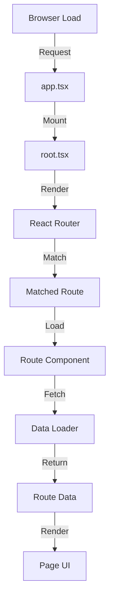

<!-- Parent: ../AGENTS.md -->
<!-- Generated: 2026-03-09 | Updated: 2026-03-09 -->

# app

## Purpose
Web 应用主源码目录，包含根组件、布局、文件路由、服务端集成和 feature 模块。

## Key Files

| File | Description |
|------|-------------|
| `root.tsx` | 应用根组件 |
| `routes.ts` | React Router 文件路由入口 |
| `app.css` | 全局样式 |
| `env.ts` | 客户端环境变量定义 |

## Subdirectories

| Directory | Purpose |
|-----------|---------|
| `features/` | 功能模块 (见 `features/AGENTS.md`) |
| `layouts/` | 页面布局 |
| `routes/` | 页面和 API 路由 |
| `services/` | 服务端集成层 |
| `types/` | Web 应用专用类型 |

## For AI Agents

### Working In This Directory
- 页面和 API 入口优先从 `routes/` 查起
- 共享业务逻辑通常放在 `features/` 或 `packages/`
- 需要服务端访问数据库、会话或后台服务时，优先查看 `services/`

## App Initialization Flow

