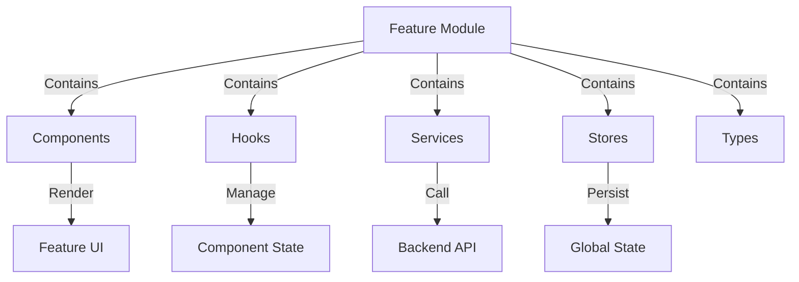

<!-- Parent: ../AGENTS.md -->
<!-- Generated: 2026-03-09 | Updated: 2026-03-09 -->

# features

## Purpose
Web 应用功能模块集合。这里按业务域拆分 UI 组件、hooks、schema、store 和类型。

## Subdirectories

| Directory | Purpose |
|-----------|---------|
| `auth/` | 认证和会话相关功能 |
| `benchmarks/` | 基准测试页相关类型 |
| `chats/` | 对话式搜索和剪辑交互 |
| `collections/` | 集合浏览与编辑 |
| `customVideoPlayer/` | 自定义视频播放器和覆盖层 |
| `faces/` | 已知/未知人脸管理 |
| `folders/` | 媒体文件夹管理 |
| `immich/` | Immich 集成界面 |
| `jobs/` | 作业状态与进度展示 |
| `onboarding/` | 首次引导流程 |
| `projects/` | 项目管理 |
| `search/` | 搜索体验与筛选 |
| `services/` | 后端服务健康状态 |
| `settings/` | 系统设置页 |
| `setup/` | 初始配置向导 |
| `shared/` | 跨功能共享 UI 与状态 |
| `videos/` | 视频列表和详情视图 |

## For AI Agents

### Working In This Directory
- 优先在对应 feature 内完成 UI 和状态修改，跨 feature 逻辑再提升到 `shared/` 或 `packages/`
- 并非每个 feature 都有完整的 `components/hooks/services/schemas` 结构，先看实际目录

## Feature Module Structure

