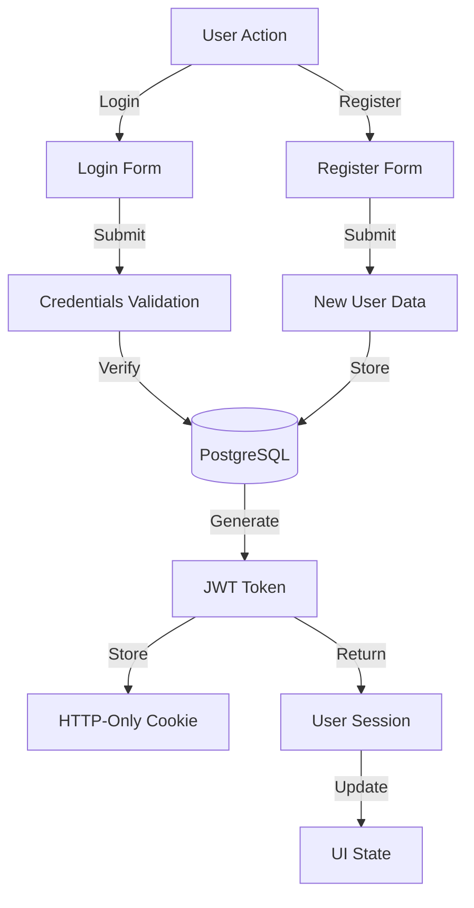
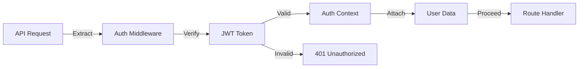

<!-- Parent: ../../AGENTS.md -->
<!-- Generated: 2026-03-09 | Updated: 2026-03-09 -->

# auth

## Purpose
认证功能模块，处理用户登录、注册和会话管理。

## Subdirectories

| Directory | Purpose |
|-----------|---------|
| `components/` | 认证 UI 组件 |
| `hooks/` | 认证钩子函数 |
| `providers/` | 认证上下文 |
| `schemas/` | 认证数据验证 |

<!-- MANUAL: -->

## Authentication Flow

## Session Management Flow

