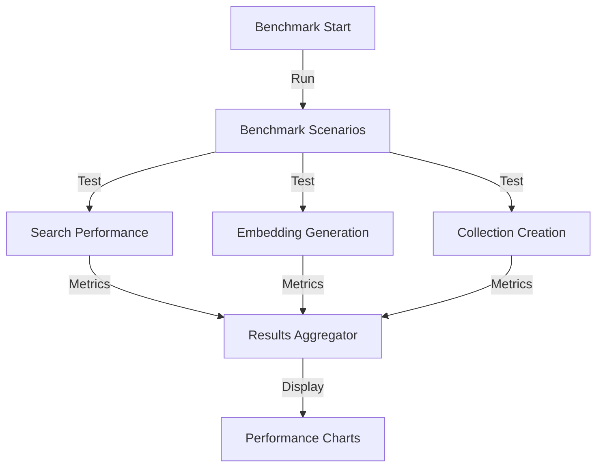

<!-- MANUAL: -->

## Benchmark Execution Flow

```mermaid
flowchart TB
    Start[Benchmark Start] -->|Run| Scenarios[Benchmark Scenarios]
    Scenarios -->|Test| Search[Search Performance]
    Scenarios -->|Test| Embedding[Embedding Generation]
    Scenarios -->|Test| Collection[Collection Creation]
    Search -->|Metrics| Results[Results Aggregator]
    Embedding -->|Metrics| Results
    Collection -->|Metrics| Results
    Results -->|Display| Chart[Performance Charts]
```