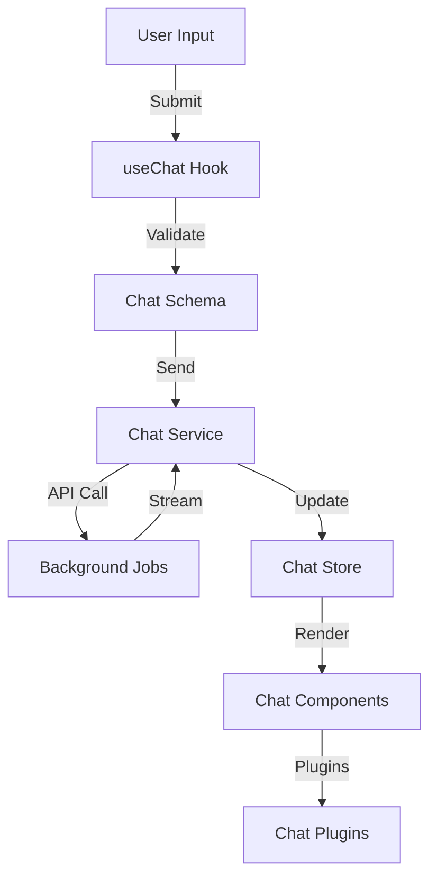
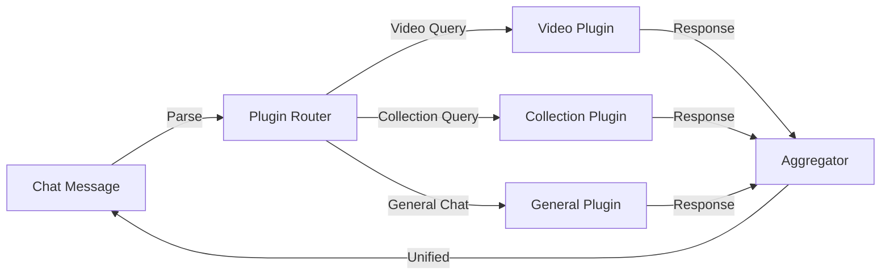

<!-- Parent: ../../AGENTS.md -->
<!-- Generated: 2026-03-09 | Updated: 2026-03-09 -->

# chats

## Purpose
聊天功能模块，支持对话式视频编辑和查询。

## Subdirectories

| Directory | Purpose |
|-----------|---------|
| `components/` | 聊天 UI 组件 |
| `hooks/` | 聊天钩子函数 |
| `plugins/` | 聊天插件 |
| `schemas/` | 消息验证 |
| `services/` | 聊天服务 |
| `stores/` | 聊天状态管理 |
| `types/` | 聊天类型 |
| `utils/` | 聊天工具 |

<!-- MANUAL: -->

## Chat Message Flow

## Plugin Architecture

