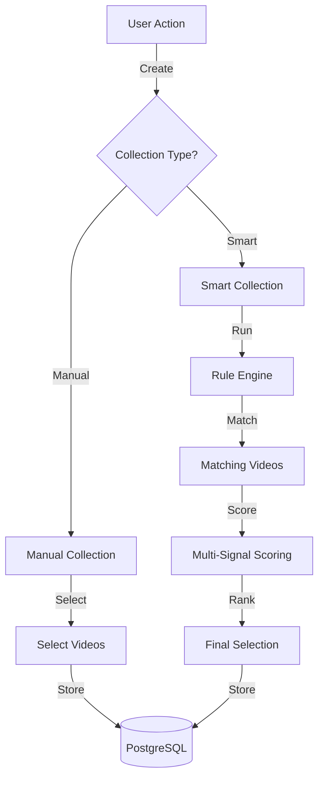
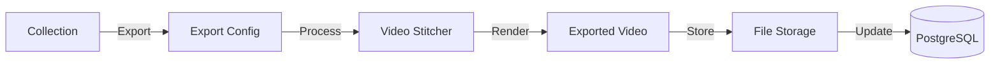

<!-- Parent: ../../AGENTS.md -->
<!-- Generated: 2026-03-09 | Updated: 2026-03-09 -->

# collections

## Purpose
集合管理功能模块，包括智能集合和手动集合。

## Subdirectories

| Directory | Purpose |
|-----------|---------|
| `components/` | 集合 UI 组件 |
| `constants/` | 集合常量 |
| `hooks/` | 集合钩子函数 |
| `schemas/` | 集合数据验证 |
| `services/` | 集合服务 |
| `stores/` | 集合状态管理 |
| `types/` | 集合类型 |

<!-- MANUAL: -->

## Collection Creation Flow

## Collection Export Flow

