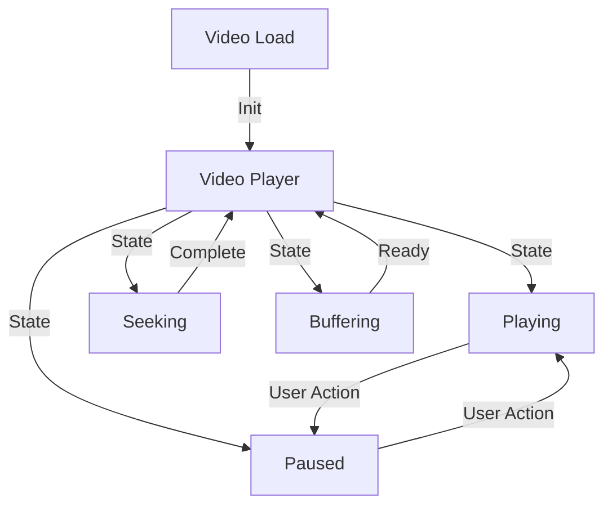
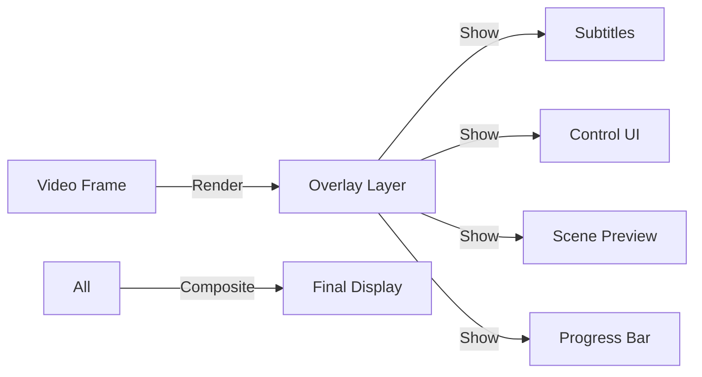

<!-- MANUAL: -->

## Video Player State Flow

```mermaid
flowchart TB
    Load[Video Load] -->|Init| Player[Video Player]
    Player -->|State| Playing[Playing]
    Player -->|State| Paused[Paused]
    Player -->|State| Seeking[Seeking]
    Player -->|State| Buffering[Buffering]
    Playing -->|User Action| Paused
    Paused -->|User Action| Playing
    Seeking -->|Complete| Player
    Buffering -->|Ready| Player
```

## Overlay Rendering Flow

```mermaid
flowchart LR
    Video[Video Frame] -->|Render| Overlay[Overlay Layer]
    Overlay -->|Show| Subtitle[Subtitles]
    Overlay -->|Show| Controls[Control UI]
    Overlay -->|Show| ScenePreview[Scene Preview]
    Overlay -->|Show| ProgressBar[Progress Bar]
    All -->|Composite| Display[Final Display]
```