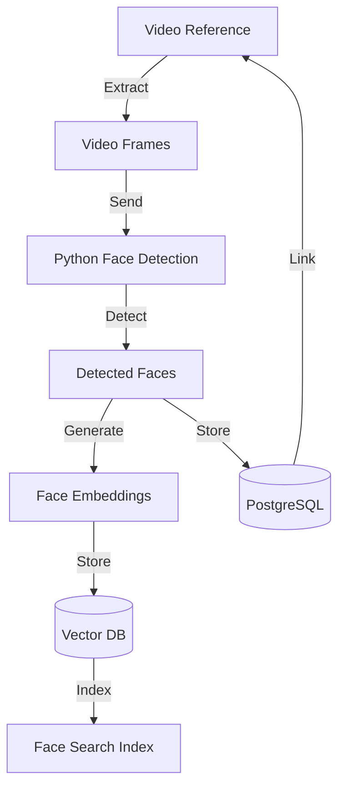
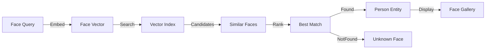

<!-- Parent: ../../AGENTS.md -->
<!-- Generated: 2026-03-09 | Updated: 2026-03-09 -->

# faces

## Purpose
面部识别功能模块，处理面部检测和匹配。

## Subdirectories

| Directory | Purpose |
|-----------|---------|
| `components/` | 面部 UI 组件 |
| `hooks/` | 面部钩子函数 |
| `schemas/` | 面部数据验证 |
| `services/` | 面部服务 |
| `stores/` | 面部状态管理 |

<!-- MANUAL: -->

## Face Detection Flow

## Face Matching Flow

