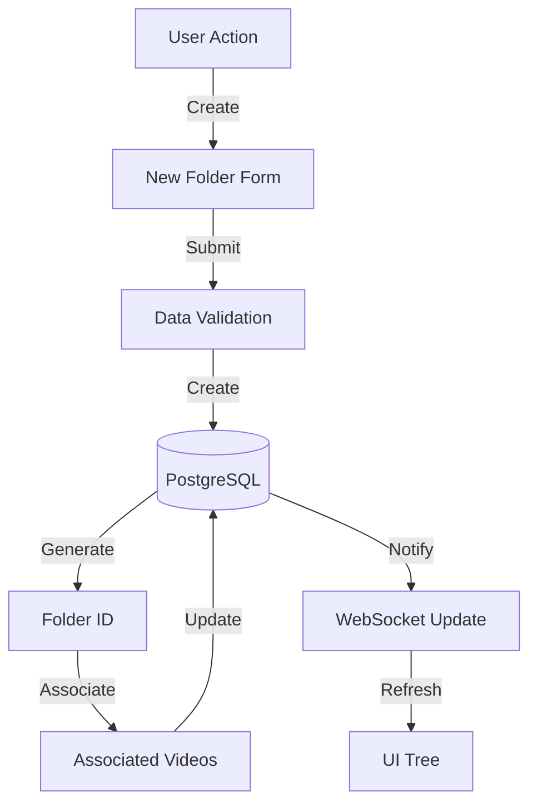
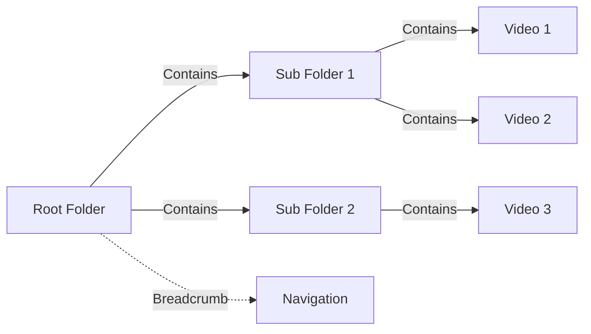

<!-- Parent: ../../AGENTS.md -->
<!-- Generated: 2026-03-09 | Updated: 2026-03-09 -->

# folders

## Purpose
文件夹管理功能模块，组织视频和媒体文件。

## Subdirectories

| Directory | Purpose |
|-----------|---------|
| `components/` | 文件夹 UI 组件 |
| `hooks/` | 文件夹钩子函数 |
| `schemas/` | 文件夹数据验证 |
| `services/` | 文件夹服务 |
| `stores/` | 文件夹状态管理 |
| `types/` | 文件夹类型 |
| `utils/` | 文件夹工具 |

<!-- MANUAL: -->

## Folder Creation Flow

## Folder Hierarchy Flow

