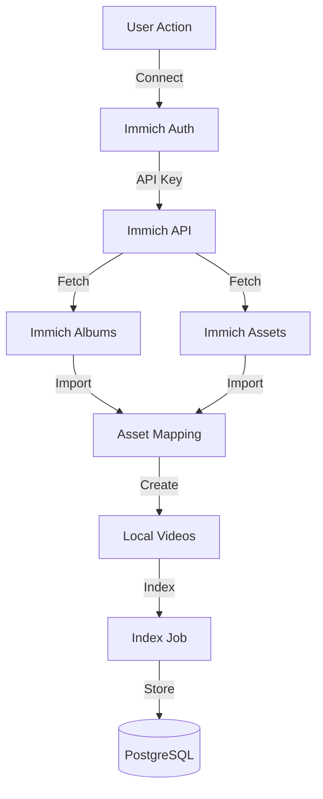
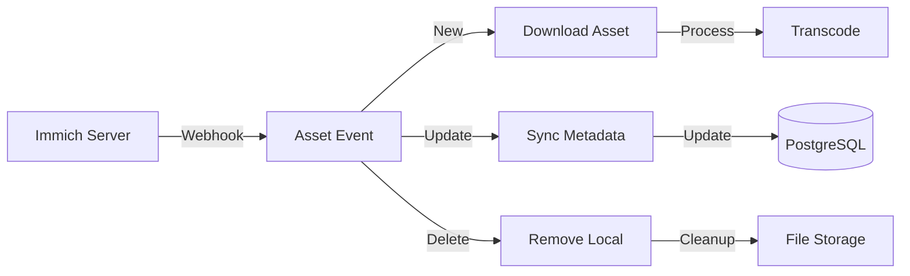

<!-- Parent: ../../AGENTS.md -->
<!-- Generated: 2026-03-09 | Updated: 2026-03-09 -->

# immich

## Purpose
Immich 集成功能模块，与 Immich 服务交互。

## Subdirectories

| Directory | Purpose |
|-----------|---------|
| `components/` | Immich UI 组件 |
| `hooks/` | Immich 钩子函数 |
| `services/` | Immich 服务 |
| `stores/` | Immich 状态管理 |
| `types/` | Immich 类型 |

<!-- MANUAL: -->

## Immich Integration Flow

## Asset Sync Flow

