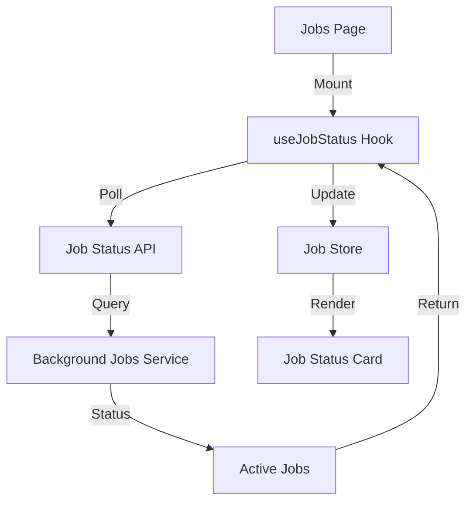
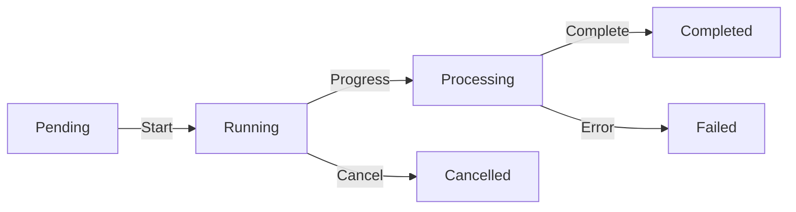

<!-- MANUAL: -->

## Job Status Polling Flow

```mermaid
flowchart TB
    Page[Jobs Page] -->|Mount| Hook[useJobStatus Hook]
    Hook -->|Poll| API[Job Status API]
    API -->|Query| BG[Background Jobs Service]
    BG -->|Status| Jobs[Active Jobs]
    Jobs -->|Return| Hook
    Hook -->|Update| Store[Job Store]
    Store -->|Render| Card[Job Status Card]
```

## Job State Transitions

```mermaid
flowchart LR
    Pending[Pending] -->|Start| Running[Running]
    Running -->|Progress| Processing[Processing]
    Processing -->|Complete| Completed[Completed]
    Processing -->|Error| Failed[Failed]
    Running -->|Cancel| Cancelled[Cancelled]
```