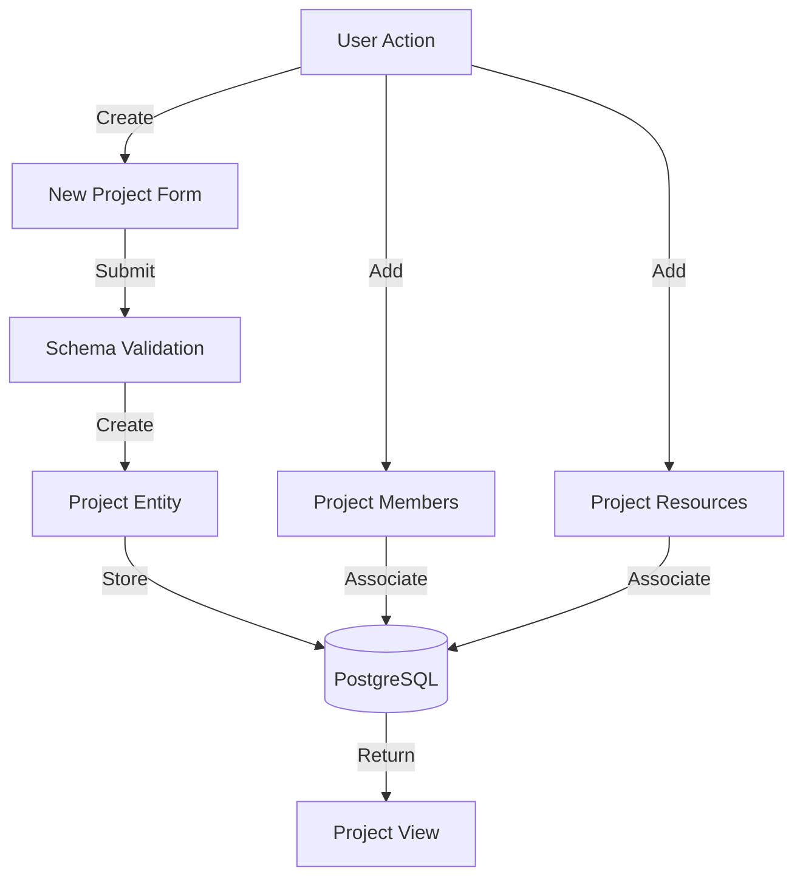
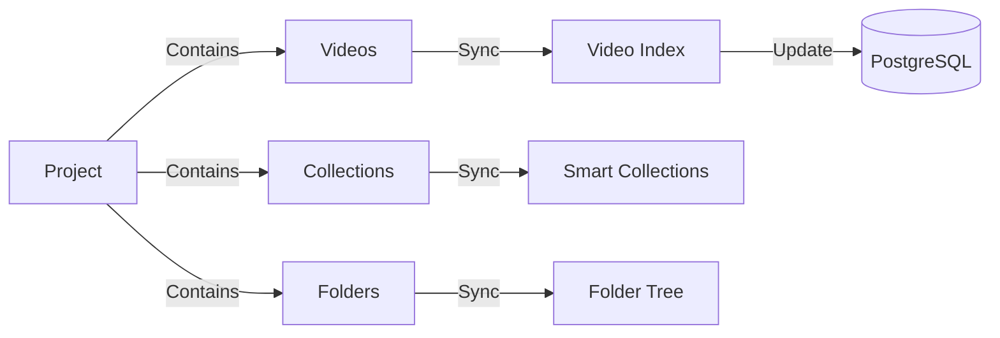

<!-- Parent: ../../AGENTS.md -->
<!-- Generated: 2026-03-09 | Updated: 2026-03-09 -->

# projects

## Purpose
项目管理功能模块，组织和管理视频项目。

## Subdirectories

| Directory | Purpose |
|-----------|---------|
| `components/` | 项目 UI 组件 |
| `hooks/` | 项目钩子函数 |
| `schemas/` | 项目数据验证 |
| `services/` | 项目服务 |
| `stores/` | 项目状态管理 |
| `types/` | 项目类型 |

<!-- MANUAL: -->

## Project Creation Flow

## Project Resource Management Flow

