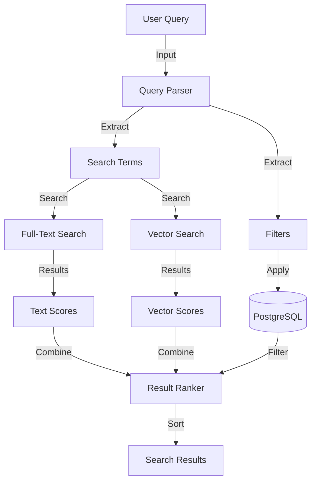
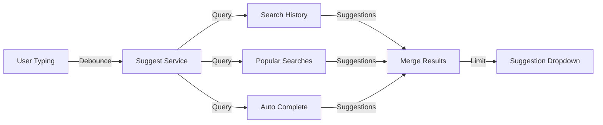

<!-- Parent: ../../AGENTS.md -->
<!-- Generated: 2026-03-09 | Updated: 2026-03-09 -->

# search

## Purpose
搜索功能模块，提供内容和视频的全文搜索。

## Subdirectories

| Directory | Purpose |
|-----------|---------|
| `components/` | 搜索 UI 组件 |
| `constants/` | 搜索常量 |
| `hooks/` | 搜索钩子函数 |
| `schemas/` | 搜索数据验证 |
| `stores/` | 搜索状态管理 |
| `types/` | 搜索类型 |

<!-- MANUAL: -->

## Hybrid Search Flow

## Search Suggestion Flow

