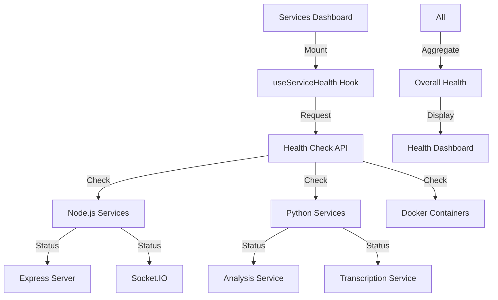

<!-- MANUAL: -->

## Service Health Check Flow

```mermaid
flowchart TB
    Dashboard[Services Dashboard] -->|Mount| Hook[useServiceHealth Hook]
    Hook -->|Request| HealthAPI[Health Check API]
    HealthAPI -->|Check| NodeServices[Node.js Services]
    HealthAPI -->|Check| PythonServices[Python Services]
    HealthAPI -->|Check| Docker[Docker Containers]
    NodeServices -->|Status| Express[Express Server]
    NodeServices -->|Status| SocketIO[Socket.IO]
    PythonServices -->|Status| Analysis[Analysis Service]
    PythonServices -->|Status| Transcription[Transcription Service]
    All -->|Aggregate| Overall[Overall Health]
    Overall -->|Display| UI[Health Dashboard]
```