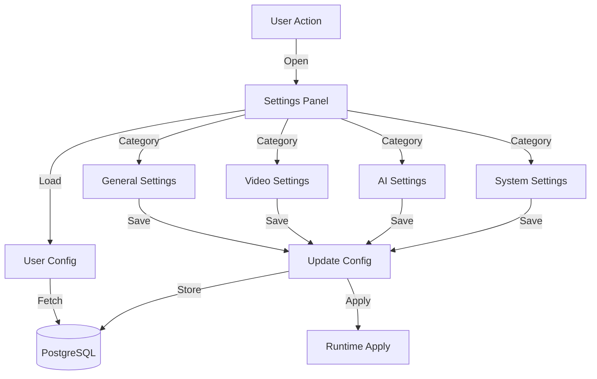
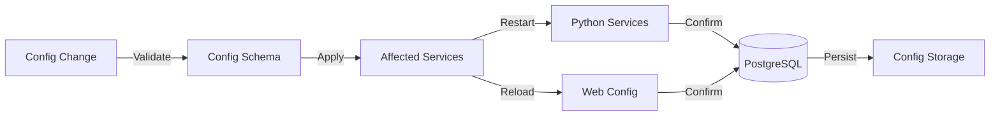

<!-- Parent: ../../AGENTS.md -->
<!-- Generated: 2026-03-09 | Updated: 2026-03-09 -->

# settings

## Purpose
设置功能模块，管理系统和用户配置。

## Subdirectories

| Directory | Purpose |
|-----------|---------|
| `components/` | 设置 UI 组件 |

<!-- MANUAL: -->

## Settings Management Flow

## Configuration Sync Flow

