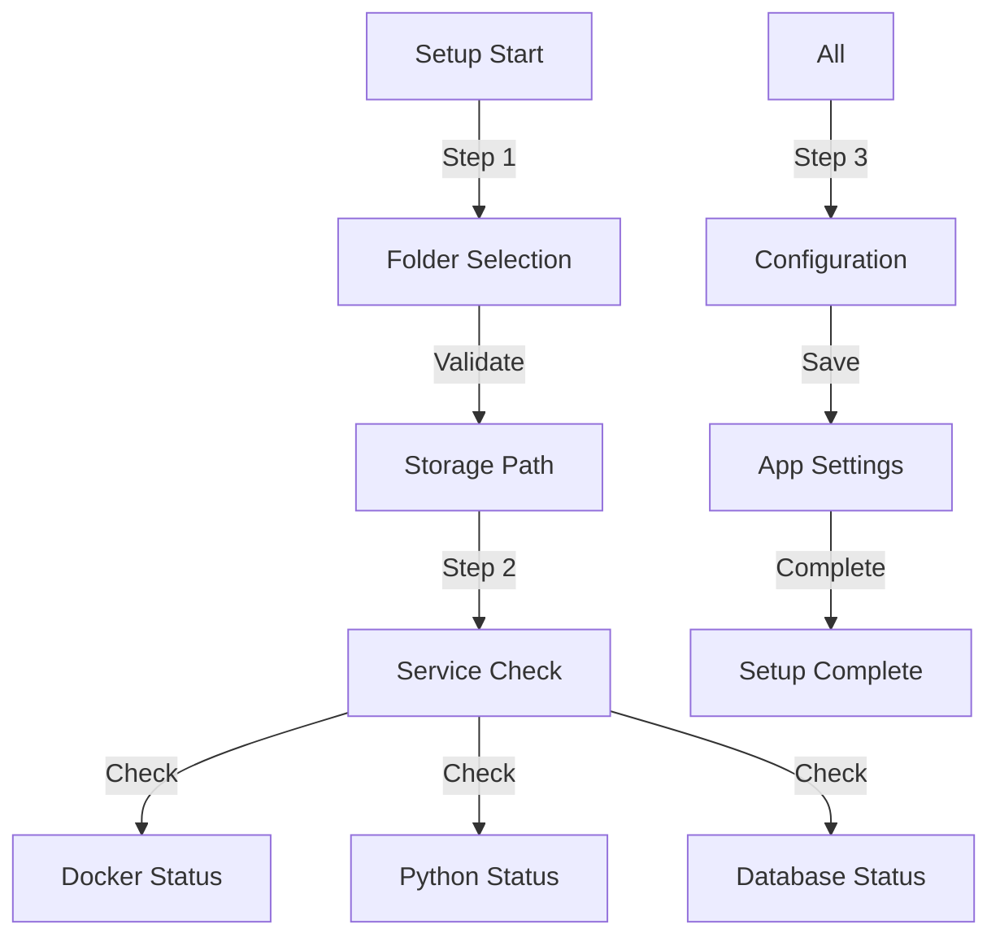

<!-- MANUAL: -->

## Setup Wizard Flow

```mermaid
flowchart TB
    Start[Setup Start] -->|Step 1| Folder[Folder Selection]
    Folder -->|Validate| Path[Storage Path]
    Path -->|Step 2| Services[Service Check]
    Services -->|Check| Docker[Docker Status]
    Services -->|Check| Python[Python Status]
    Services -->|Check| DB[Database Status]
    All -->|Step 3| Config[Configuration]
    Config -->|Save| Settings[App Settings]
    Settings -->|Complete| Done[Setup Complete]
```