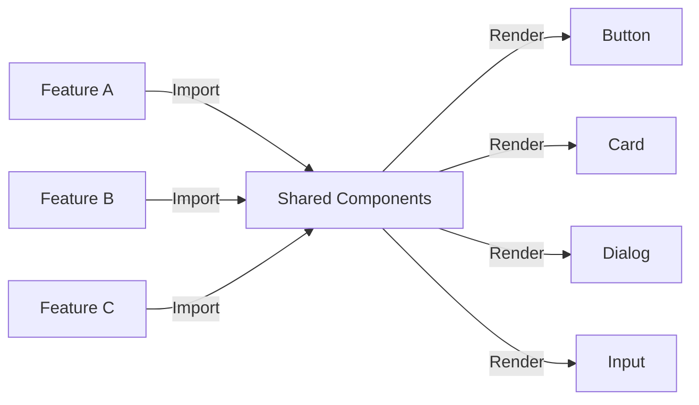

<!-- Parent: ../../AGENTS.md -->
<!-- Generated: 2026-03-09 | Updated: 2026-03-09 -->

# shared

## Purpose
共享功能和组件，在多个特性间复用。

## Subdirectories

| Directory | Purpose |
|-----------|---------|
| `components/` | 共享 UI 组件 |
| `hooks/` | 共享钩子函数 |
| `stores/` | 共享状态管理 |
| `types/` | 共享类型 |
| `utils/` | 共享工具 |

<!-- MANUAL: -->

## Shared Component Usage Flow

