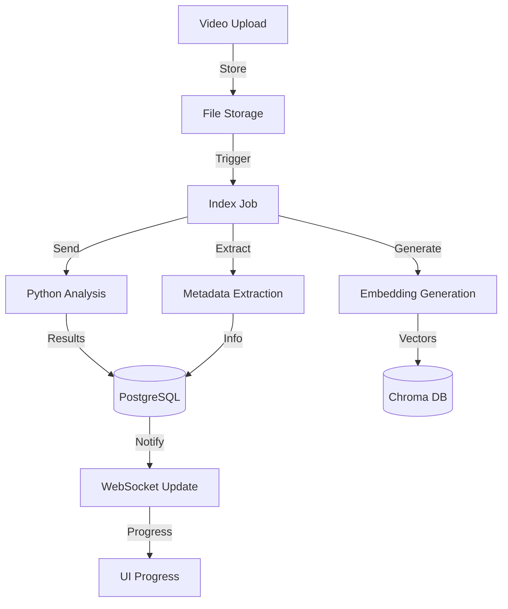
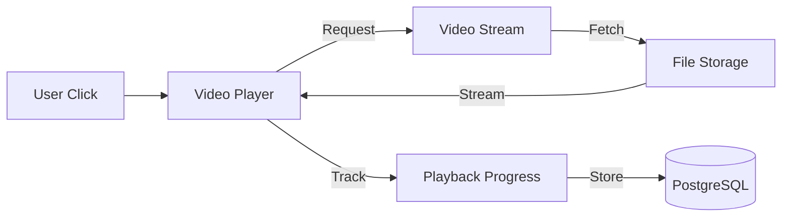

<!-- Parent: ../../AGENTS.md -->
<!-- Generated: 2026-03-09 | Updated: 2026-03-09 -->

# videos

## Purpose
视频管理功能模块，处理视频上传、索引和播放。

## Subdirectories

| Directory | Purpose |
|-----------|---------|
| `components/` | 视频 UI 组件 |
| `hooks/` | 视频钩子函数 |
| `schemas/` | 视频数据验证 |
| `services/` | 视频服务 |
| `stores/` | 视频状态管理 |
| `types/` | 视频类型 |

<!-- MANUAL: -->

## Video Index Flow

## Video Playback Flow

