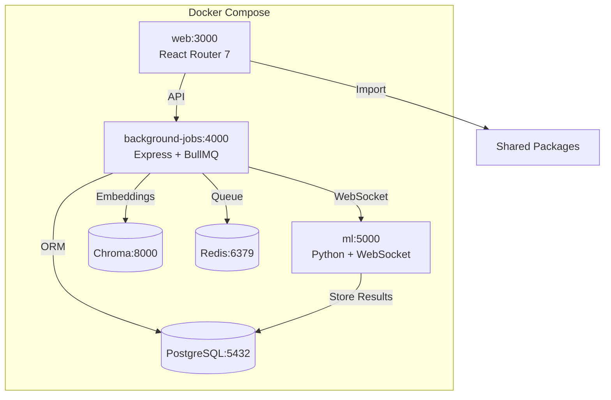
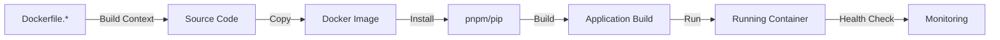

<!-- Parent: ../AGENTS.md -->
<!-- Generated: 2026-03-09 | Updated: 2026-03-09 -->

# docker

## Purpose
Dockerfiles 和 Compose 配置，分别用于本地开发、常规部署和 CUDA 版本镜像构建。

## Key Files

| File | Description |
|------|-------------|
| `docker-compose.yml` | Docker 子目录下的运行配置 |
| `docker-compose.dev.yml` | 开发环境 Compose 配置 |
| `docker-compose.cuda.yml` | CUDA 版本 Compose 配置 |
| `Dockerfile.web` | Web 镜像构建定义 |
| `Dockerfile.background-jobs` | 后台服务镜像构建定义 |
| `Dockerfile.ml` | Python/ML 镜像构建定义 |

## For AI Agents

### Working In This Directory
- 没有单一 `Dockerfile`，修改时要确认对应服务的镜像定义
- 开发环境优先使用 `docker-compose.dev.yml`
- CUDA 配置需要 NVIDIA Container Toolkit

## Docker Compose Architecture

## Build Flow

<!-- MANUAL: -->
