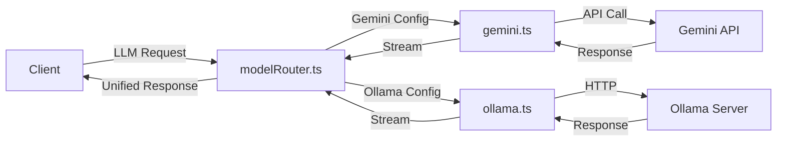
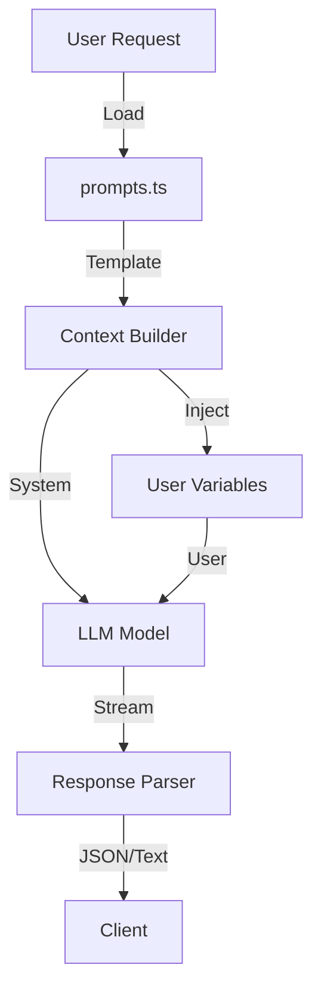

<!-- Parent: ../AGENTS.md -->
<!-- Generated: 2026-03-09 | Updated: 2026-03-09 -->

# ai

## Purpose
AI/LLM 集成层，负责在 Gemini 和 Ollama 之间路由请求，并生成聊天、分析和编排响应。

## Key Files

| File | Description |
|------|-------------|
| `src/services/modelRouter.ts` | 模型选择和统一调用入口 |
| `src/services/gemini.ts` | Gemini 实现 |
| `src/services/ollama.ts` | Ollama 实现 |
| `src/constants/prompts.ts` | Prompt 模板定义 |

## Subdirectories

| Directory | Purpose |
|-----------|---------|
| `src/constants/` | 常量和配置 |
| `src/services/` | AI 服务实现 |
| `src/types/` | 类型定义 |
| `src/utils/` | 工具函数 |
| `tests/` | 测试套件 |

## For AI Agents

### Working In This Directory
- 使用 Gemini 和 Ollama 进行 AI 交互
- prompts 定义在 constants 中
- 服务层处理 API 调用和响应

## Model Router Flow

## Prompt Processing

<!-- MANUAL: -->
