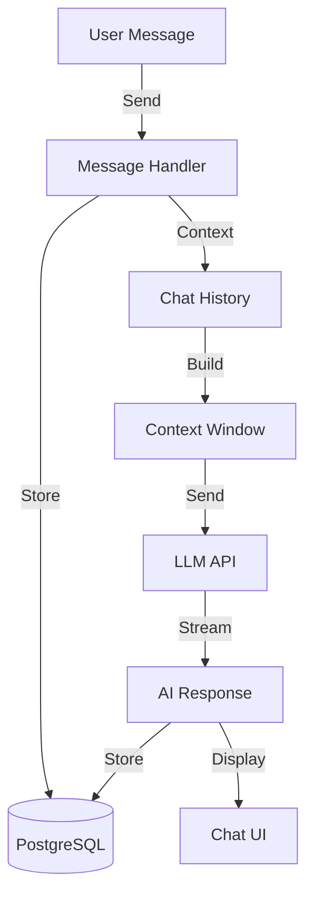
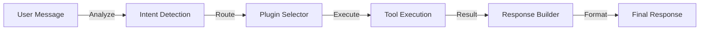

<!-- Parent: ../AGENTS.md -->
<!-- Generated: 2026-03-09 | Updated: 2026-03-09 -->

# chat

## Purpose
聊天功能核心，处理聊天消息、会话管理和对话历史。

## Key Files

| File | Description |
|------|-------------|
| `src/index.ts` | 服务入口 |
| `src/handlers/` | 消息处理器 |
| `src/services/` | 聊天服务 |

## Subdirectories

| Directory | Purpose |
|-----------|---------|
| `src/handlers/` | 消息处理逻辑 |
| `src/services/` | 聊天业务服务 |
| `src/types/` | 聊天类型定义 |

<!-- MANUAL: -->

## Chat Message Flow

## Plugin Handler Flow

