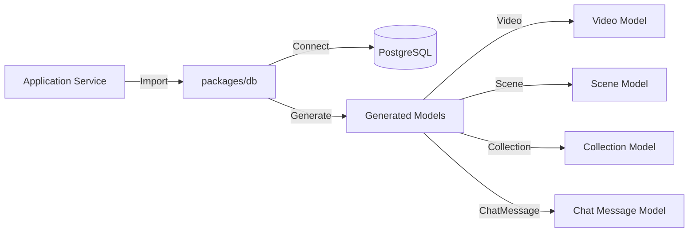
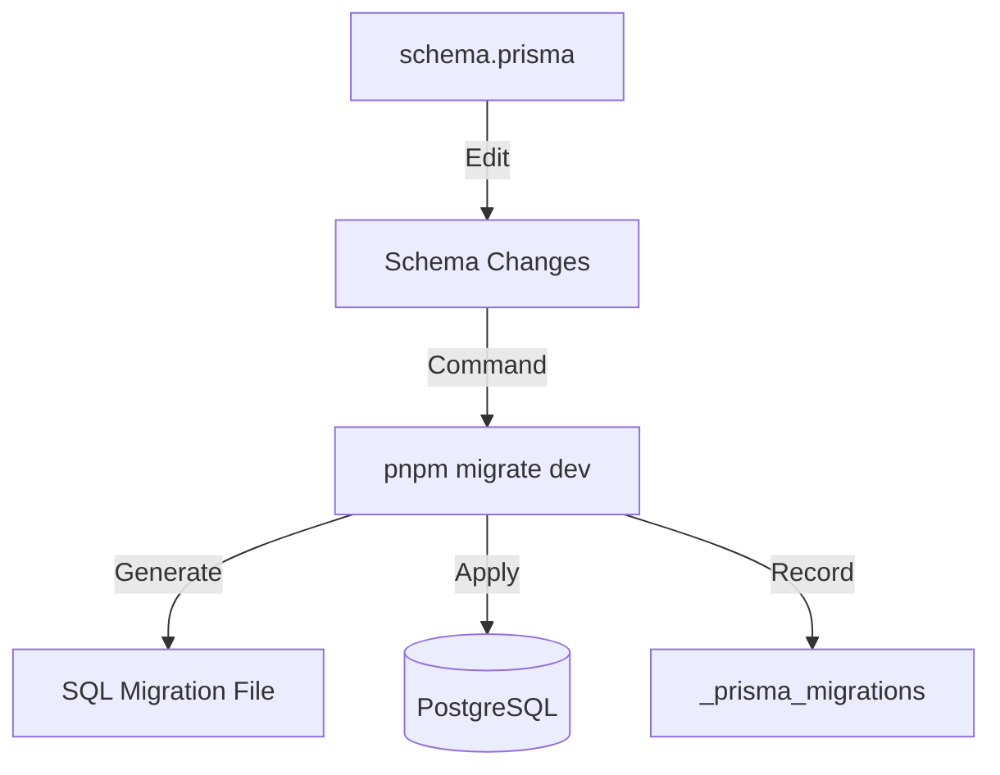

<!-- Parent: ../AGENTS.md -->
<!-- Generated: 2026-03-09 | Updated: 2026-03-09 -->

# db

## Purpose
数据库工具和模型，提供 Prisma ORM 封装和数据库操作工具。

## Key Files

| File | Description |
|------|-------------|
| `src/index.ts` | 服务入口 |
| `src/models/` | 数据模型 |
| `src/utils/` | 数据库工具 |

## Subdirectories

| Directory | Purpose |
|-----------|---------|
| `src/models/` | 数据模型定义 |
| `src/utils/` | 数据库工具函数 |

<!-- MANUAL: -->

## Database Query Flow

## Migration Flow

