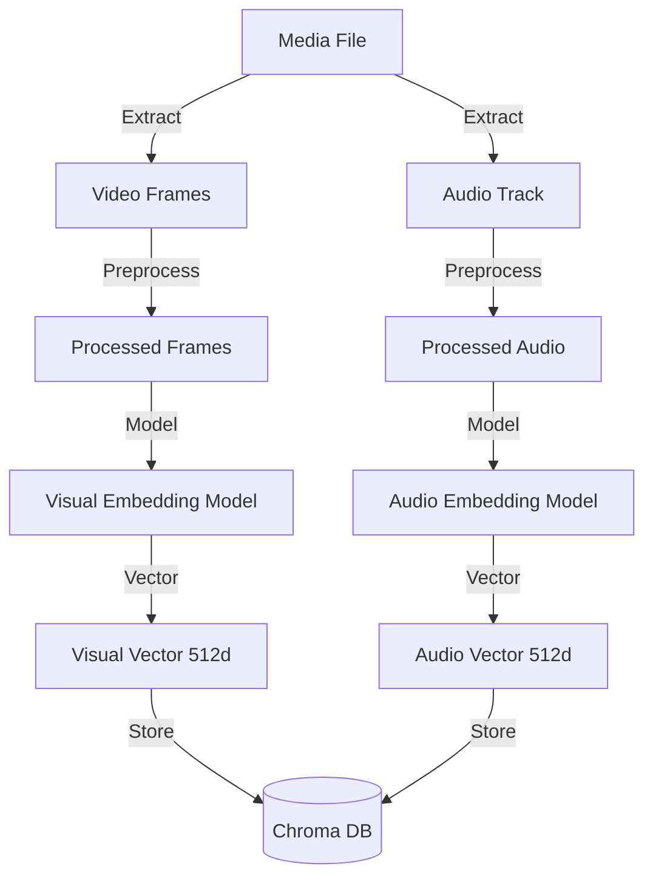
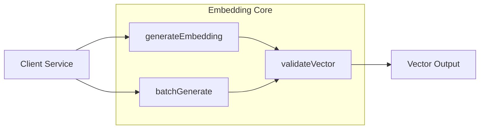

<!-- Parent: ../AGENTS.md -->
<!-- Generated: 2026-03-09 | Updated: 2026-03-09 -->

# embedding-core

## Purpose
嵌入核心服务，提供媒体嵌入生成的核心功能。

## Key Files

| File | Description |
|------|-------------|
| `src/index.ts` | 服务入口 |
| `src/services/` | 嵌入服务 |

## Subdirectories

| Directory | Purpose |
|-----------|---------|
| `src/services/` | 嵌入业务逻辑 |
| `src/utils/` | 嵌入工具 |

<!-- MANUAL: -->

## Embedding Generation Flow

## Embedding Service Architecture

