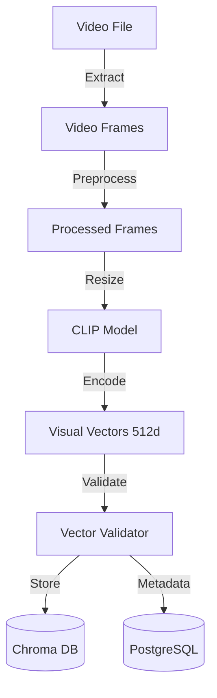
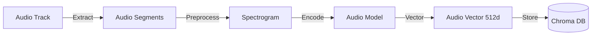

<!-- Parent: ../AGENTS.md -->
<!-- Generated: 2026-03-09 | Updated: 2026-03-09 -->

# embedding-media

## Purpose
媒体嵌入服务，负责视觉和音频向量生成，供场景级搜索和相似性匹配使用。

## Key Files

| File | Description |
|------|-------------|
| `src/services/embed.ts` | 嵌入编排入口 |
| `src/services/index.ts` | 服务导出 |
| `src/utils/visualEmbedding.ts` | 视觉嵌入实现 |
| `src/utils/audioEmbedding.ts` | 音频嵌入实现 |

## Subdirectories

| Directory | Purpose |
|-----------|---------|
| `src/services/` | 媒体业务逻辑 |
| `src/utils/` | 媒体工具 |

<!-- MANUAL: -->

## Visual Embedding Flow

## Audio Embedding Flow

