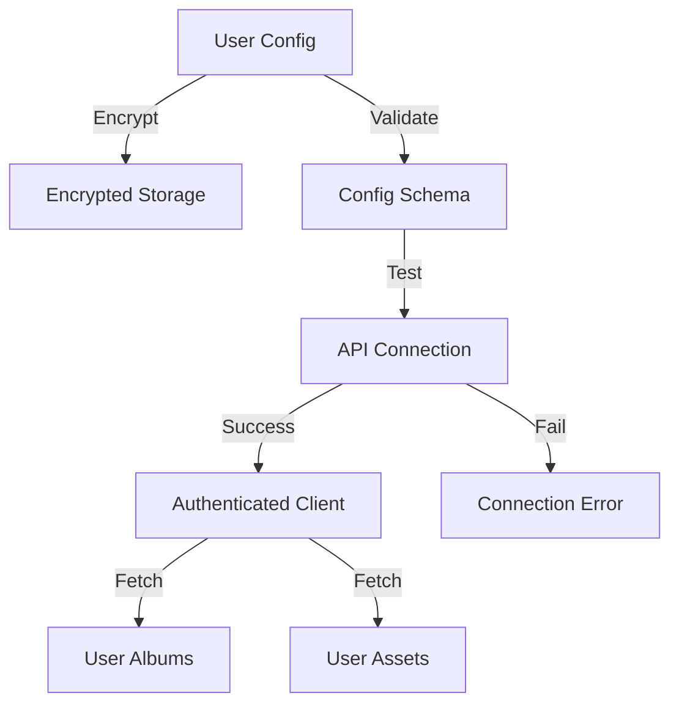

<!-- Parent: ../AGENTS.md -->
<!-- Generated: 2026-03-09 | Updated: 2026-03-09 -->

# immich

## Purpose
Immich 集成层，处理配置加密、连接测试、远程资源获取以及人脸导入相关逻辑。

## Key Files

| File | Description |
|------|-------------|
| `src/services/immich.ts` | Immich API 客户端 |
| `src/services/encryption.ts` | 集成配置加密逻辑 |
| `src/schemas/immich.ts` | Immich 配置校验 |

## Subdirectories

| Directory | Purpose |
|-----------|---------|
| `src/constants/` | Immich 常量 |
| `src/schemas/` | 数据验证 |
| `src/services/` | Immich 业务逻辑 |
| `src/types/` | Immich 类型 |
| `src/utils/` | Immich 工具 |

<!-- MANUAL: -->

## Immich Connection Flow

## Asset Import Flow

