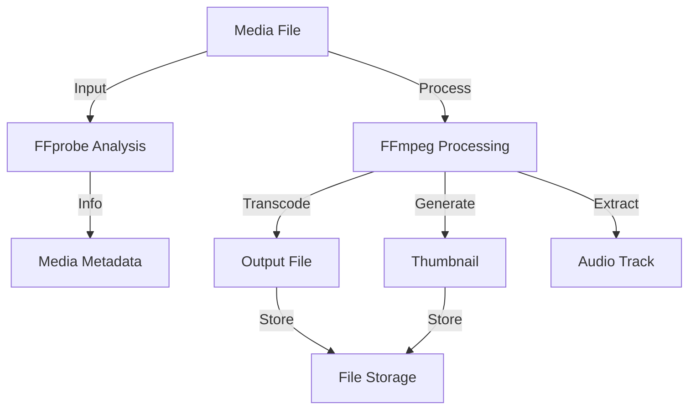

<!-- Parent: ../AGENTS.md -->
<!-- Generated: 2026-03-09 | Updated: 2026-03-09 -->

# media-utils

## Purpose
媒体处理工具库，封装 ffmpeg/ffprobe、缩略图生成、场景切分、导出裁剪和拼接能力。

## Key Files

| File | Description |
|------|-------------|
| `src/lib/ffmpeg.ts` | ffmpeg/ffprobe 封装 |
| `src/utils/scenes.ts` | 场景生成工具 |
| `src/utils/stitcher.ts` | 视频拼接工具 |
| `src/utils/thumbnails.ts` | 缩略图工具 |

## Subdirectories

| Directory | Purpose |
|-----------|---------|
| `src/constants/` | 媒体常量 |
| `src/lib/` | 核心库函数 |
| `src/types/` | 媒体类型 |
| `src/utils/` | 工具函数 |

<!-- MANUAL: -->

## FFmpeg Processing Flow

## Video Stitcher Flow

