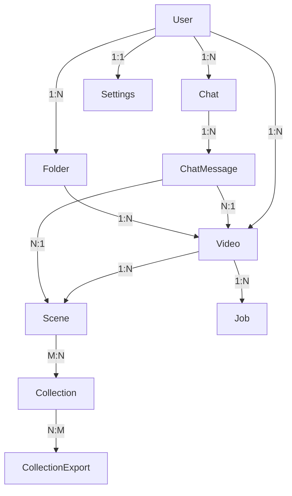

<!-- Parent: ../AGENTS.md -->
<!-- Generated: 2026-03-09 | Updated: 2026-03-09 -->

# prisma

## Purpose
Prisma ORM 模式和数据库迁移定义。

## Key Files

| File | Description |
|------|-------------|
| `schema.prisma` | 数据库模式定义 |
| `migrations/` | 数据库迁移文件 |

## Subdirectories

| Directory | Purpose |
|-----------|---------|
| `migrations/` | 数据库模式迁移历史 |

## For AI Agents

### Working In This Directory
- 修改 schema.prisma 后运行 `pnpm --filter prisma generate`
- 迁移使用 `pnpm --filter prisma migrate`
- 不要手动修改迁移文件

<!-- MANUAL: -->

## Schema.prisma Entity Relationships

## Migration Lifecycle

```mermaid
flowchart LR
    Dev[Development] -->|Edit Schema| Schema[Schema Change]
    Schema -->|Create Migration| NewMigration[new migration file]
    NewMigration -->|Review| Review[Review SQL]
    Review -->|Apply| DB[(Database)]
    DB -->|Test| App[Application Test]
    App -->|Commit| Git[Git Commit]
    Git -->|Deploy| Prod[Production]
    Prod -->|Migrate| ProdDB[Production DB]
```

