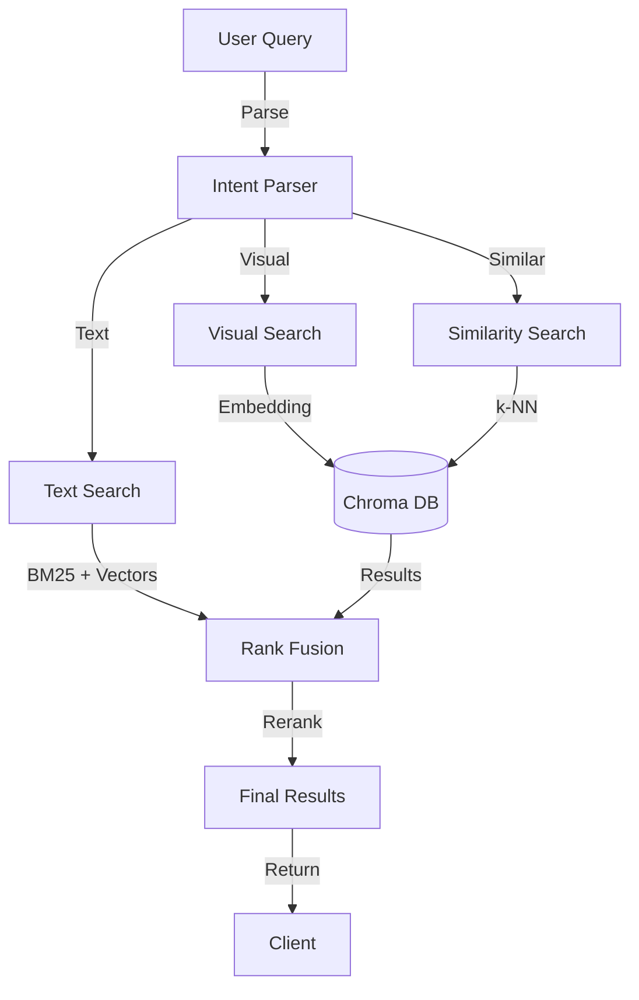
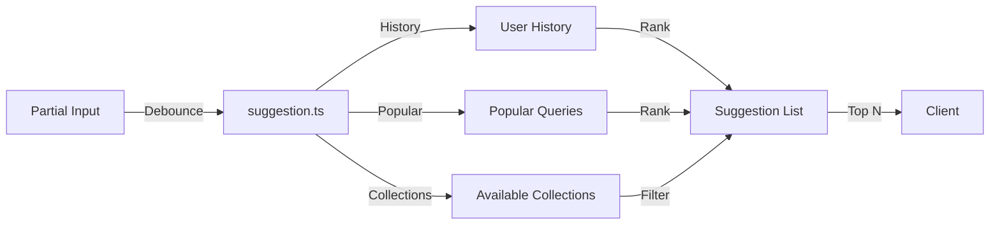

<!-- Parent: ../AGENTS.md -->
<!-- Generated: 2026-03-09 | Updated: 2026-03-09 -->

# search

## Purpose
搜索服务，提供混合搜索、视觉搜索、相似搜索以及搜索建议生成。

## Key Files

| File | Description |
|------|-------------|
| `src/services/index.ts` | 搜索服务导出 |
| `src/services/hybridSearch.ts` | 混合搜索实现 |
| `src/services/visualSearch.ts` | 图像/视觉搜索实现 |
| `src/services/suggestion.ts` | 搜索建议生成 |

## Subdirectories

| Directory | Purpose |
|-----------|---------|
| `src/constants/` | 搜索常量 |
| `src/services/` | 搜索业务逻辑 |
| `src/utils/` | 搜索工具 |

<!-- MANUAL: -->

## Hybrid Search Flow

## Search Suggestion Generation

