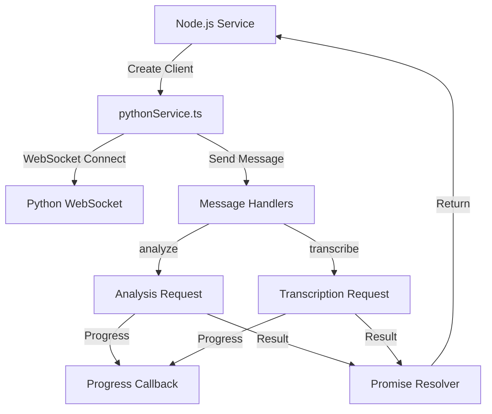
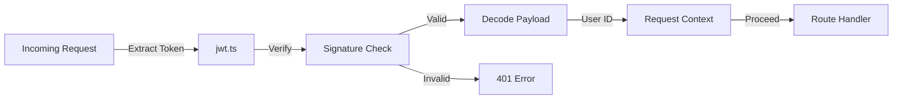

<!-- Parent: ../AGENTS.md -->
<!-- Generated: 2026-03-09 | Updated: 2026-03-09 -->

# shared

## Purpose
跨应用共享层，包含 Zod 模式、通用类型、日志、JWT、缓存、路径校验以及 Python 服务客户端。

## Key Files

| File | Description |
|------|-------------|
| `src/schemas/index.ts` | Schema 导出入口 |
| `src/services/pythonService.ts` | Node 到 Python WebSocket 客户端 |
| `src/services/jwt.ts` | 内部服务鉴权逻辑 |
| `src/types/index.ts` | 共享类型导出 |

## Subdirectories

| Directory | Purpose |
|-----------|---------|
| `src/constants/` | 共享常量 |
| `src/schemas/` | Zod 验证模式 |
| `src/services/` | 共享服务 |
| `src/types/` | TypeScript 类型 |
| `src/utils/` | 工具函数 |
| `tests/` | 测试套件 |

<!-- MANUAL: -->

## Python Service Communication Flow

## JWT Authentication Flow

