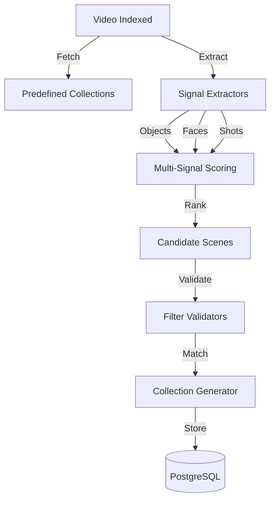
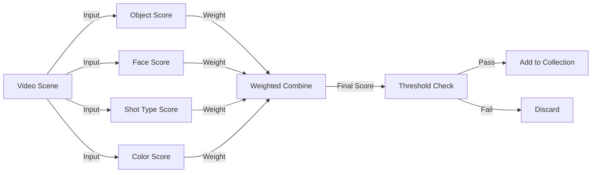

<!-- Parent: ../AGENTS.md -->
<!-- Generated: 2026-03-09 | Updated: 2026-03-09 -->

# smart-collections

## Purpose
智能集合逻辑，基于预定义集合、过滤器和多信号评分为视频场景生成集合。

## Key Files

| File | Description |
|------|-------------|
| `src/constants/collections.ts` | 预定义集合定义 |
| `src/filters/validators.ts` | 过滤器校验逻辑 |
| `src/services/collection.ts` | 集合生成服务 |
| `src/scoring/multi-signal.ts` | 多信号评分逻辑 |

## Subdirectories

| Directory | Purpose |
|-----------|---------|
| `src/constants/` | 常量配置 |
| `src/filters/` | 过滤逻辑 |
| `src/generators/` | 自动集合生成 |
| `src/scoring/` | 评分算法 |
| `src/services/` | 业务服务 |
| `src/types/` | 类型定义 |
| `src/utils/` | 工具函数 |

<!-- MANUAL: -->

## Collection Generation Flow

## Multi-Signal Scoring

