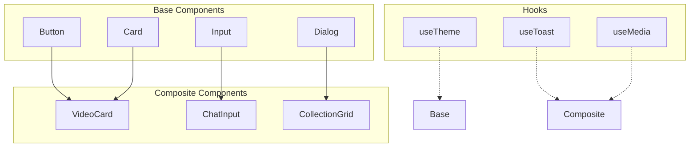
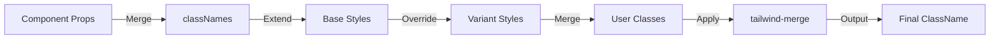

<!-- Parent: ../AGENTS.md -->
<!-- Generated: 2026-03-09 | Updated: 2026-03-09 -->

# ui

## Purpose
UI 组件库，提供可复用的 React 组件和样式。

## Key Files

| File | Description |
|------|-------------|
| `src/index.ts` | 组件导出入口 |
| `src/components/` | React 组件 |

## Subdirectories

| Directory | Purpose |
|-----------|---------|
| `src/components/` | UI 组件实现 |

## For AI Agents

### Working In This Directory
- 组件使用 TypeScript 编写
- 组件通过 `src/index.ts` 统一导出
- 组件样式以 utility classes 和 `tailwind-merge` 组合为主

<!-- MANUAL: -->

## Component Architecture

## Component Styling Flow

