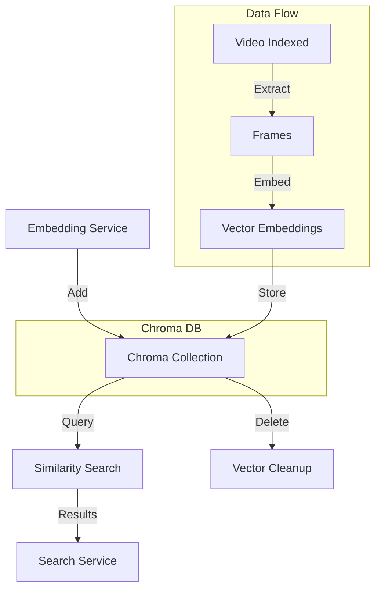
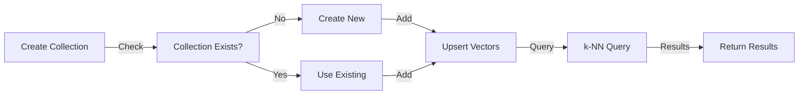

<!-- Parent: ../AGENTS.md -->
<!-- Generated: 2026-03-09 | Updated: 2026-03-09 -->

# vector

## Purpose
向量存储层，负责管理 Chroma 集合、场景向量写入以及相似检索所需的数据访问。

## Key Files

| File | Description |
|------|-------------|
| `src/services/client.ts` | Chroma 客户端封装 |
| `src/services/db.ts` | 向量集合读写逻辑 |
| `src/types/vector.ts` | 向量模型类型 |

## Subdirectories

| Directory | Purpose |
|-----------|---------|
| `src/constants/` | 向量常量 |
| `src/services/` | 向量业务逻辑 |
| `src/types/` | 向量类型 |
| `src/utils/` | 向量工具 |

<!-- MANUAL: -->

## Vector Storage Architecture

## Collection Lifecycle

