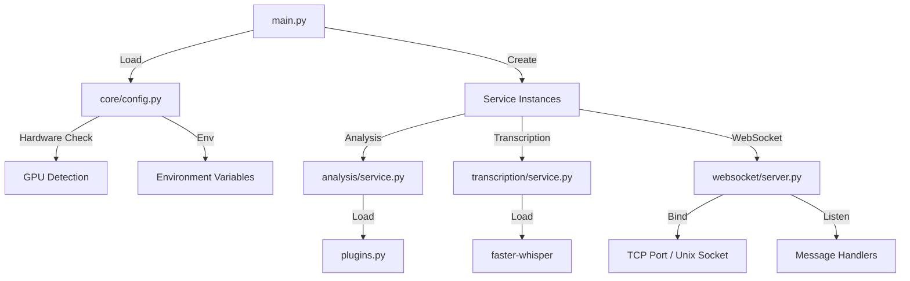
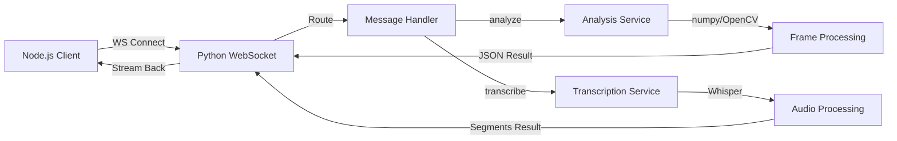

<!-- Parent: ../AGENTS.md -->
<!-- Generated: 2026-03-09 | Updated: 2026-03-09 -->

# python

## Purpose
Python 运行时服务，负责视频帧分析、语音转录以及通过 WebSocket 暴露 `health`、`analyze`、`transcribe` 能力。

## Key Files

| File | Description |
|------|-------------|
| `main.py` | Python 服务入口 |
| `core/config.py` | 服务配置与硬件参数 |
| `services/analysis/service.py` | 视频分析服务 |
| `services/transcription/service.py` | 转录服务 |
| `services/websocket/server.py` | WebSocket 服务器 |

## Subdirectories

| Directory | Purpose |
|-----------|---------|
| `core/` | 配置、错误和协议类型 (见 `core/AGENTS.md`) |
| `services/` | 主要运行时服务 (见 `services/AGENTS.md`) |
| `utils/` | 通用辅助函数 (见 `utils/AGENTS.md`) |
| `monitoring/` | 内存和指标工具 (见 `monitoring/AGENTS.md`) |
| `plugins/` | 分析插件实现 (见 `plugins/AGENTS.md`) |
| `.faces/` | 已知人脸参考图片 (见 `.faces/AGENTS.md`) |

## For AI Agents

### Working In This Directory
- Python 3.10+ 环境
- 与 Node.js 服务通过定义的协议通信

### Common Patterns
- 异步服务使用 asyncio
- 数值和图像处理大量使用 numpy/OpenCV

## Service Startup Flow

## Python <-> Node.js Integration

<!-- MANUAL: -->
