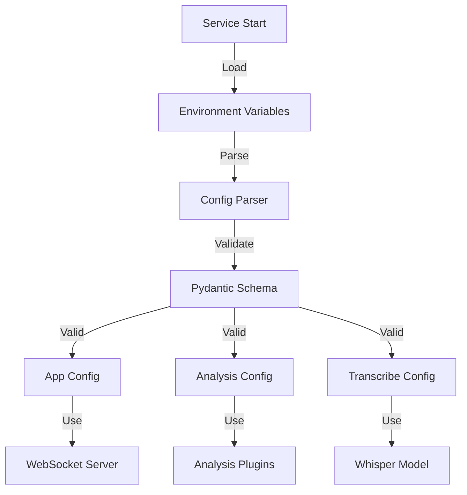
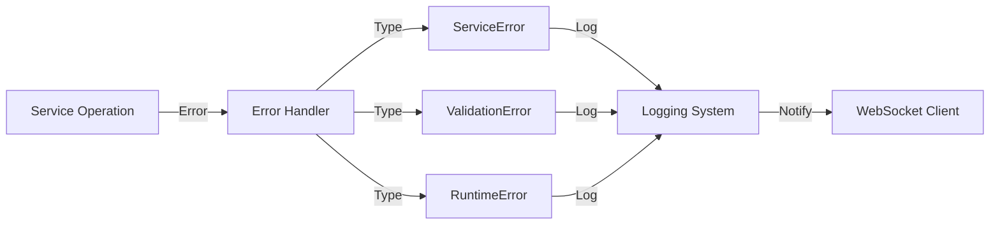

<!-- MANUAL: -->

## Configuration Loading Flow

```mermaid
flowchart TB
    Start[Service Start] -->|Load| Env[Environment Variables]
    Env -->|Parse| Config[Config Parser]
    Config -->|Validate| Schema[Pydantic Schema]
    Schema -->|Valid| AppConfig[App Config]
    Schema -->|Valid| AnalysisConfig[Analysis Config]
    Schema -->|Valid| TranscribeConfig[Transcribe Config]
    AppConfig -->|Use| Server[WebSocket Server]
    AnalysisConfig -->|Use| Plugins[Analysis Plugins]
    TranscribeConfig -->|Use| Model[Whisper Model]
```

## Error Handling Flow

```mermaid
flowchart LR
    Operation[Service Operation] -->|Error| Handler[Error Handler]
    Handler -->|Type| ServiceError[ServiceError]
    Handler -->|Type| ValidationError[ValidationError]
    Handler -->|Type| RuntimeError[RuntimeError]
    ServiceError -->|Log| Logger[Logging System]
    ValidationError -->|Log| Logger
    RuntimeError -->|Log| Logger
    Logger -->|Notify| Client[WebSocket Client]
```