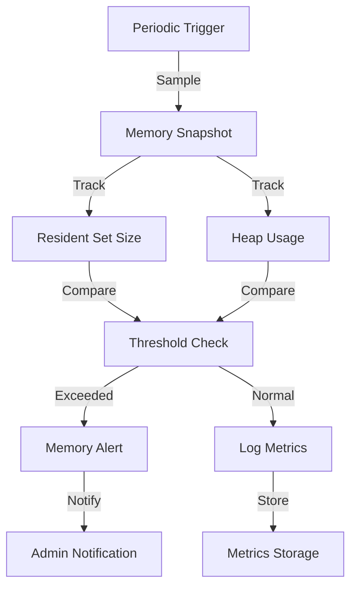
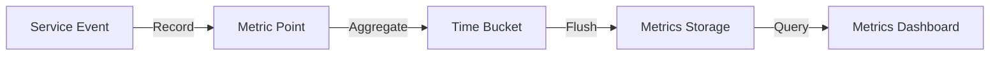

<!-- MANUAL: -->

## Memory Monitoring Flow

```mermaid
flowchart TB
    Trigger[Periodic Trigger] -->|Sample| Memory[Memory Snapshot]
    Memory -->|Track| RSS[Resident Set Size]
    Memory -->|Track| Heap[Heap Usage]
    RSS -->|Compare| Threshold[Threshold Check]
    Heap -->|Compare| Threshold
    Threshold -->|Exceeded| Alert[Memory Alert]
    Threshold -->|Normal| Log[Log Metrics]
    Alert -->|Notify| Admin[Admin Notification]
    Log -->|Store| Metrics[Metrics Storage]
```

## Metrics Collection Flow

```mermaid
flowchart LR
    Event[Service Event] -->|Record| Metric[Metric Point]
    Metric -->|Aggregate| Bucket[Time Bucket]
    Bucket -->|Flush| Storage[Metrics Storage]
    Storage -->|Query| Dashboard[Metrics Dashboard]
```