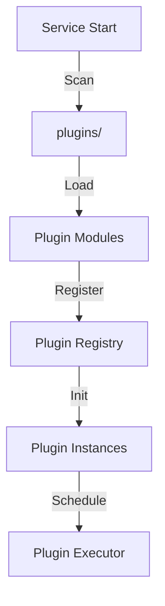
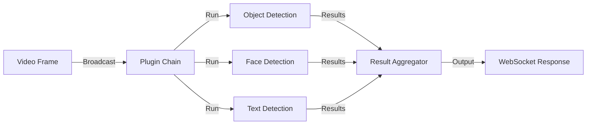

<!-- MANUAL: -->

## Plugin Loading Flow

```mermaid
flowchart TB
    Start[Service Start] -->|Scan| PluginDir[plugins/]
    PluginDir -->|Load| Modules[Plugin Modules]
    Modules -->|Register| Registry[Plugin Registry]
    Registry -->|Init| Instances[Plugin Instances]
    Instances -->|Schedule| Executor[Plugin Executor]
```

## Plugin Execution Flow

```mermaid
flowchart LR
    Frame[Video Frame] -->|Broadcast| PluginChain[Plugin Chain]
    PluginChain -->|Run| ObjectDetect[Object Detection]
    PluginChain -->|Run| FaceDetect[Face Detection]
    PluginChain -->|Run| TextDetect[Text Detection]
    ObjectDetect -->|Results| Aggregate[Result Aggregator]
    FaceDetect -->|Results| Aggregate
    TextDetect -->|Results| Aggregate
    Aggregate -->|Output| WebSocket[WebSocket Response]
```