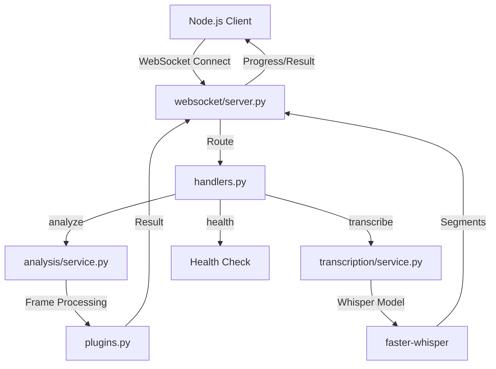
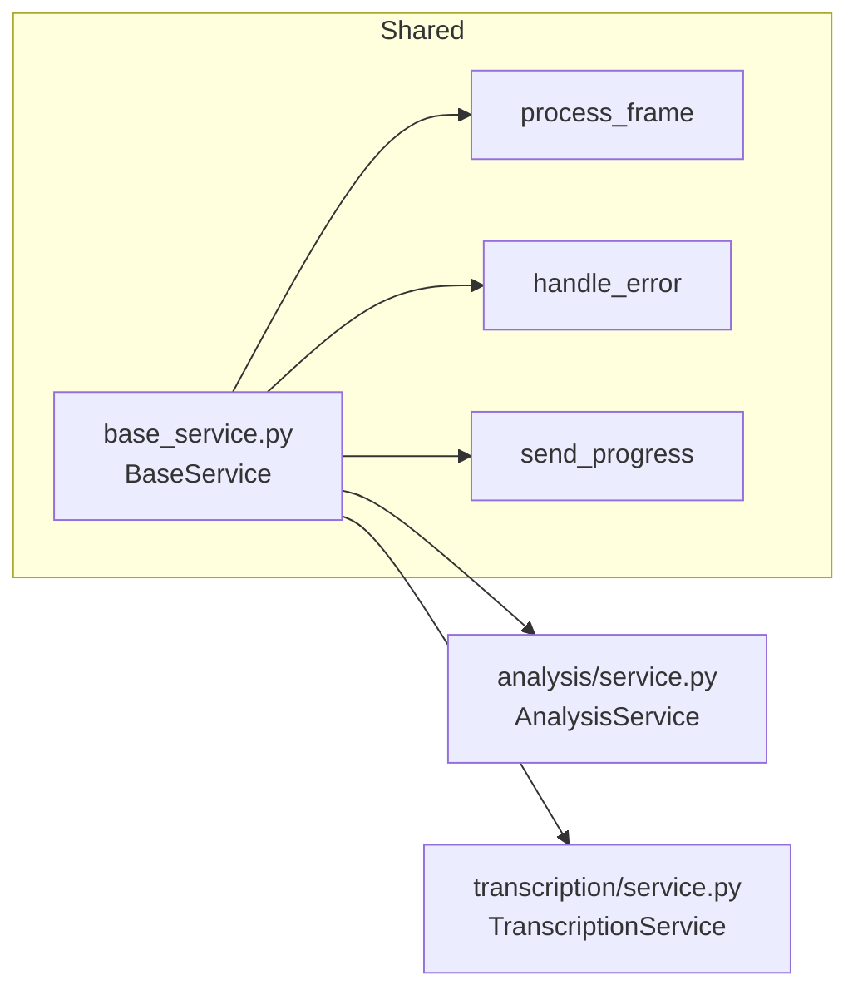

<!-- Parent: ../AGENTS.md -->
<!-- Generated: 2026-03-09 | Updated: 2026-03-09 -->

# services

## Purpose
Python 运行时服务实现层，包括帧分析、语音转录、通用处理基类和 WebSocket 协议处理。

## Key Files

| File | Description |
|------|-------------|
| `base_service.py` | 分析/转录共用处理基类 |
| `analysis/service.py` | 视频分析服务 |
| `transcription/service.py` | 语音转录服务 |
| `websocket/server.py` | WebSocket 服务器 |

## Subdirectories

| Directory | Purpose |
|-----------|---------|
| `analysis/` | AI 驱动的视频分析 |
| `transcription/` | 语音到文本转换 |
| `websocket/` | 实时通信服务 |

## For AI Agents

### Working In This Directory
- Python 异步服务使用 asyncio
- 与 Node.js 服务通过 WebSocket 通信
- 结果通过 WebSocket 消息返回给上游调用方

## WebSocket Message Flow

## Service Inheritance

<!-- MANUAL: -->
