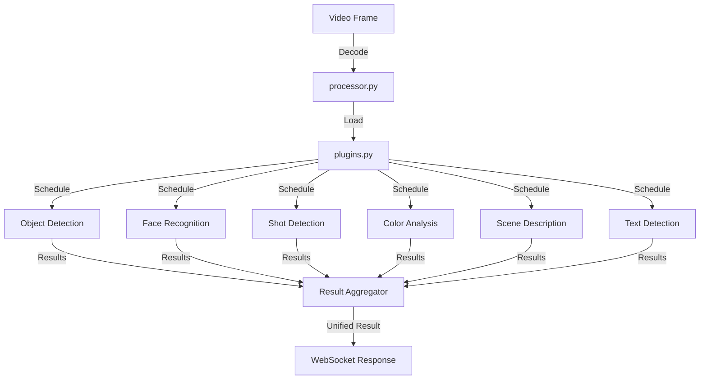
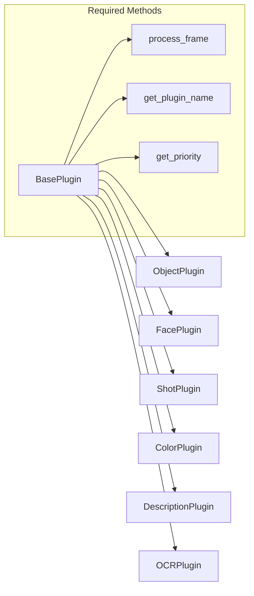

<!-- Parent: ../AGENTS.md -->
<!-- Generated: 2026-03-09 | Updated: 2026-03-09 -->

# analysis

## Purpose
插件式视频帧分析服务，负责对象识别、人脸识别、镜头类型、主色调、描述和文字检测。

## Key Files

| File | Description |
|------|-------------|
| `service.py` | 分析服务入口 |
| `processor.py` | 帧处理流程 |
| `plugins.py` | 插件加载与调度 |
| `result.py` | 分析结果模型 |

## For AI Agents

### Working In This Directory
- 使用 OpenCV 处理视频帧
- 分析结果由插件聚合后返回给 WebSocket 层
- 面部匹配逻辑位于 `face_recognizer.py`

<!-- MANUAL: -->

## Frame Analysis Pipeline

## Plugin Architecture

