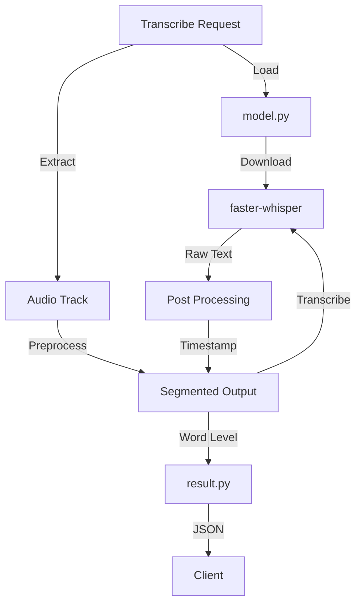

<!-- Parent: ../AGENTS.md -->
<!-- Generated: 2026-03-09 | Updated: 2026-03-09 -->

# transcription

## Purpose
语音转录服务，将视频音轨转换为带分段和词级时间戳的文本结果。

## Key Files

| File | Description |
|------|-------------|
| `service.py` | 转录服务入口 |
| `model.py` | Whisper 模型管理 |
| `result.py` | 转录结果模型 |

## For AI Agents

### Working In This Directory
- 使用 faster-whisper 模型进行转录
- 支持多语言识别
- 输出带时间戳的字幕

## Transcription Flow

<!-- MANUAL: -->
