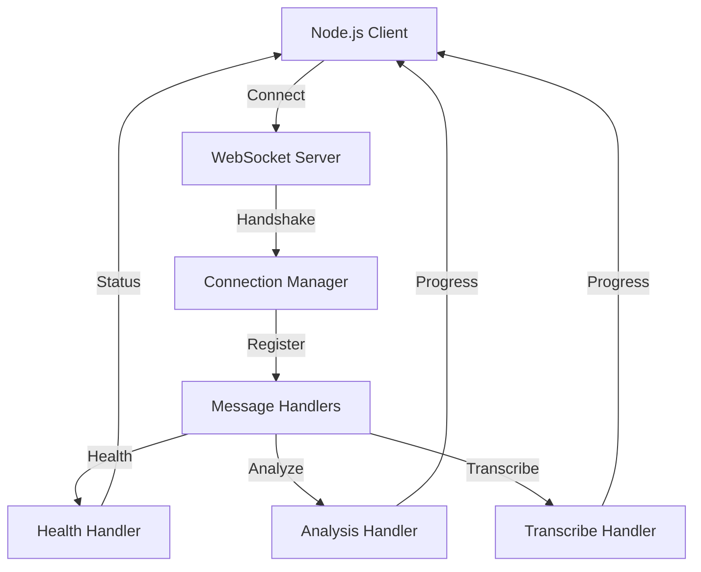
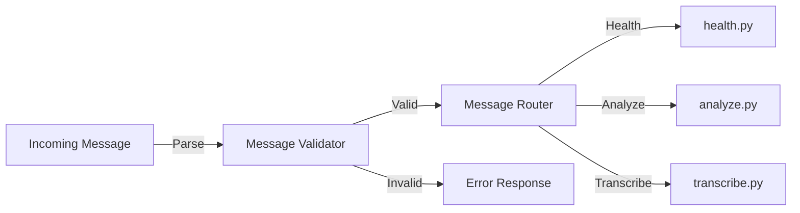

<!-- Parent: ../AGENTS.md -->
<!-- Generated: 2026-03-09 | Updated: 2026-03-09 -->

# websocket

## Purpose
WebSocket 服务器，向上游服务暴露 `health`、`analyze` 和 `transcribe` 消息接口。

## Key Files

| File | Description |
|------|-------------|
| `server.py` | WebSocket 服务器 |
| `handlers.py` | 消息处理器 |
| `messages.py` | 消息路由与协议校验 |
| `connection.py` | 连接管理 |

## For AI Agents

### Working In This Directory
- 使用 `websockets` 库而不是 FastAPI
- 支持 TCP 端口和 Unix socket 两种监听方式
- 负责连接管理、消息路由和进度回调保护

<!-- MANUAL: -->

## WebSocket Connection Flow

## Message Routing Flow

