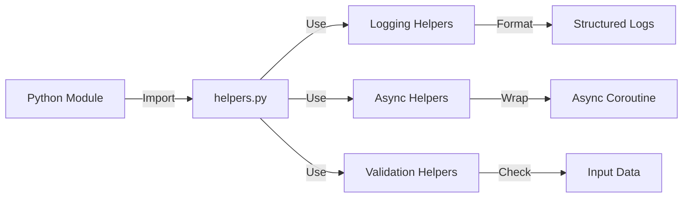

<!-- MANUAL: -->

## Helper Functions Usage Flow

```mermaid
flowchart LR
    Module[Python Module] -->|Import| Helpers[helpers.py]
    Helpers -->|Use| Logging[Logging Helpers]
    Helpers -->|Use| Async[Async Helpers]
    Helpers -->|Use| Validation[Validation Helpers]
    Logging -->|Format| LogOutput[Structured Logs]
    Async -->|Wrap| Coroutine[Async Coroutine]
    Validation -->|Check| Data[Input Data]
```